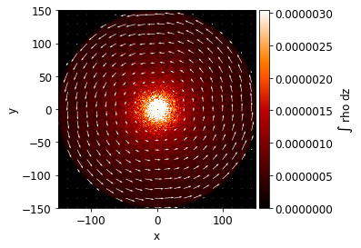
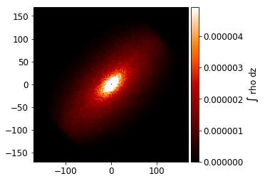
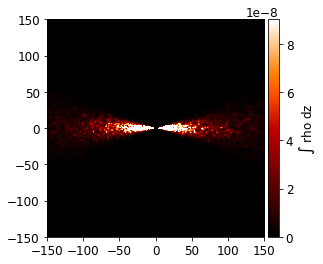
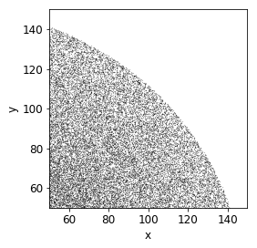

========
Examples
========

----------------
Reading SPH data
----------------

Here we demonstrate reading in a collection of Phantom HDF dump files, on which we will perform visualization and analysis.

.. code:: ipython3

    from plonk.dump import Dump

Read the dump files into a list. Each element of the list is a Plonk Dump object.

.. code:: ipython3

    dump_file_names = ['data/disc_00000.h5']

    dumps = list()

    for dump_file_name in dump_file_names:
        print(f'Reading {dump_file_name}...')
        dump = Dump(dump_file_name)
        dumps.append(dump)

We can access the dump parameters, i.e. the Phantom header. This is a dictionary with keys given by the Phantom header. For example, we can access ``hfact``, ``alpha``, etc.

.. code:: ipython3

    hfact = dumps[0].parameters["hfact"]
    alpha = dumps[0].parameters["alpha"]

    print(f'hfact = {hfact:.1f}')
    print(f'alpha = {alpha:.3f}')

*Output:*

.. parsed-literal::

    hfact = 1.0
    alpha = 0.236

There is also a dictionary for units where the value is the value of the code units in cgs units.

.. code:: ipython3

    for key in dumps[0].units:
        print(f'{key:20} {dumps[0].units[key]}')

*Output:*

.. parsed-literal::

    distance             14960000000000.0
    mass                 1.9891e+33
    time                 5022728.790082334
    frequency            1.9909496247827625e-07
    velocity             2978460.6386750126
    momentum             5.924456056388467e+39
    force                1.1795293562508584e+33
    pressure             5270424.14464802
    energy               1.1795293562508584e+33
    density              5.94103125029151e-07
    surface_density      8887782.7504361
    angular_momentum     8.862986260357147e+52
    torque               1.7645759169512842e+46

The particle data is stored as a Pandas DataFrame. Every particle has a type (``itype``), positions (``x, y, z``), mass (``m``), smoothing length (``h``), and density (``rho``, computed from the smoothing length), as well as any other quantities stored in the dump file, such as velocity (``vx, vy, vz``), dust fraction (``dustfrac``), and so on. For example, the following shows the first 5 particles of the first dump file.

.. code:: ipython3

    dumps[0].particles.iloc[:5]

*Output:*

.. csv-table::
   :file: _static/part.csv

Similarly we have access to the sink particle data stored as a Pandas DataFrame.

.. code:: ipython3

    dumps[0].sinks

*Output:*

.. csv-table::
   :file: _static/sink.csv

------------------
Analyzing SPH data
------------------

We can perform analysis on the SPH data. The function ``disc_analysis`` is equivalent to the Phantom analysis module available in ``analysis_disc.f90``.

.. code:: ipython3

    from plonk.analysis.disc import disc_analysis

This analysis assumes a single disc around a single star (represented as a sink particle). We need to define the number of radial bins to average our data, as well as the inner and outer disc radius.

.. code:: ipython3

    number_radial_bins = 200
    radius_in          = 1
    radius_out         = 150

The analysis produces a list of Pandas DataFrames ``radial_averages``. Each DataFrame has index associated with the radial bin.

.. code:: ipython3

    radial_averages = list()
    particles       = list()
    sinks           = list()

    for dump in dumps:

        print('\nPerforming disc analysis...\n')
        radial_averages_ = disc_analysis( radius_in          = radius_in,
                                          radius_out         = radius_out,
                                          number_radial_bins = number_radial_bins,
                                          dump               = dump )

        radial_averages.append(radial_averages_)

Now we can use the data in radial_averages to plot radially averaged quantities such as the surface density profile, or the disc aspect ratio, for example.

.. code:: ipython3

    import matplotlib.pyplot as plt

    fig, ax = plt.subplots(2)

    for df in radial_averages:
        ax[0].plot(df['R'], df['sigma'])
    ax[0].set_xlabel('radius')
    ax[0].set_ylabel('surface density')

    for df in radial_averages:
        ax[1].plot(df['R'], df['H'])
    ax[1].set_xlabel('radius')
    ax[1].set_ylabel('scale height')

.. image:: _static/examples1.png

--------------------
Visualizing SPH data
--------------------

We can use highly-optimized Splash interpolation routines to visualize SPH data.

.. code:: ipython3

    from plonk.visualization.image import Image

We create a list of Image objects. One for each dump file.

.. code:: ipython3

    images = list()
    for dump in dumps:
        images.append(Image(dump))

Then we plot, for example, the column density:

.. code:: ipython3

    images[0].plot(render='rho', render_fraction_max=0.05)

.. image:: _static/examples2.png

We can overlay vector fields:

.. code:: ipython3

    images[0].plot(render='rho', vector='v', render_fraction_max=0.05)

We can rotate about an arbitrary axis:

.. code:: ipython3

    images[0].plot(render='rho', rotation_angle=np.pi/3, rotation_axis=[1, 1, 0],
                   render_fraction_max=0.05)

We can take a cross-section:

.. code:: ipython3

    images[0].plot(render='rho', rotation_angle=np.pi/2, rotation_axis=[1, 0, 0],
                   cross_section=True, render_fraction_max=0.01)

We can plot the particles. (This is somewhat slow.)

.. code:: ipython3

    images[0].plot(horizontal_range=[50, 150], vertical_range=[50, 150])

