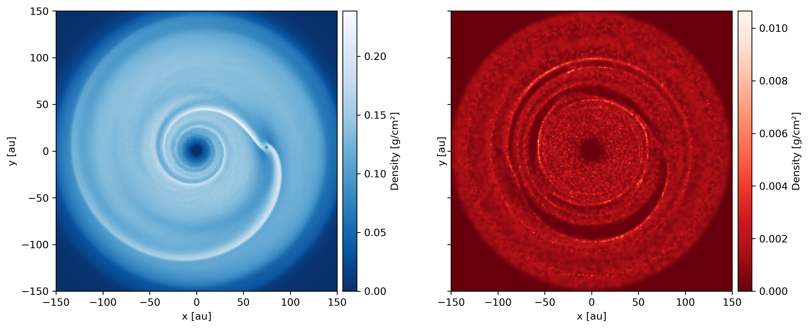

========
Examples
========

---------------
Rotate snapshot
---------------

Rotate a snapshot and plot column density.

.. code-block:: pycon

    >>> import matplotlib.pyplot as plt
    >>> import numpy as np
    >>> import plonk
    >>> from scipy.spatial.transform import Rotation

    # Load the snapshot
    >>> snap = plonk.load_snap('disc_00030.h5')

    # Define a rotation vector via scipy.spatial.transform
    >>> rotation_angle = np.pi / 2.5
    >>> rotation_vector = np.array([1, 1, 0])
    >>> rotation_vector = rotation_vector / np.linalg.norm(rotation_vector)
    >>> rotation = Rotation.from_rotvec(rotation_angle * rotation_vector)

    # Apply the rotation to the snapshot
    >>> snap.rotate(rotation)

    # Plot
    >>> plonk.visualize.render(snap, quantity='rho')
    >>> plt.show()

.. figure:: _static/rotate.png

-------------
Cross section
-------------

Plot cross section at z=0.

.. code-block:: pycon

    >>> import matplotlib.pyplot as plt
    >>> import plonk

    # Load the snapshot
    >>> snap = plonk.load_snap('disc_00030.h5')

    # Plot cross section
    >>> interpolation_options = {'cross_section': 0.0}
    >>> plonk.visualize.render(
    ...     snap,
    ...     quantity='rho',
    ...     interpolation_options=interpolation_options,
    ...     extent=(-150, 150, -150, 150),
    ... )
    >>> plt.show()

.. figure:: _static/cross_section.png

------------
Side by side
------------

Plot dust and gas side-by-side.

.. code-block:: pycon

    >>> import matplotlib.pyplot as plt
    >>> import plonk

    # Load the snapshot
    >>> snap = plonk.load_snap('disc_00030.h5')

    # Specify dust and gas subsnaps
    >>> gas = snap['gas']
    >>> dust = snap['dust']
    >>> extent = (-150, 150, -150, 150)

    # Make plot
    >>> fig, axes = plt.subplots(ncols=2, sharey=True, figsize=(12, 5))
    >>> plonk.visualize.render(
    ...     gas,
    ...     quantity='rho',
    ...     extent=extent,
    ...     scalar_options={'cmap': 'Blues_r'},
    ...     axis=axes[0],
    ... )
    >>> plonk.visualize.render(
    ...     dust,
    ...     quantity='rho',
    ...     extent=extent,
    ...     scalar_options={'cmap': 'Reds_r'},
    ...     axis=axes[0],
    ... )
    >>> plt.show()

------------------------------------
Vector plot with coordinate tranform
------------------------------------

Transform to cylindrical coordinates and plot velocity vectors in the rz-plane.

.. code-block:: pycon

    >>> import matplotlib.pyplot as plt
    >>> import numpy as np
    >>> import plonk

    # Load snapshot
    >>> snap = plonk.load_snap('disc_00030.h5')

    # Transform to cylindrical coordinates (r, phi, z)
    >>> plonk.utils.coordinate_transform(
    ...     position=snap['position'],
    ...     velocity=snap['velocity'],
    ...     geometry_from='cartesian',
    ...     geometry_to='cylindrical',
    ...     in_place=True,
    ... )

    # Planet position in cylindrical coords
    >>> planet, _ = plonk.utils.coordinate_transform(
    ...     position=snap.sinks['position'][1, np.newaxis],
    ...     geometry_from='cartesian',
    ...     geometry_to='cylindrical',
    ...     in_place=False,
    ... )
    >>> planet = planet.flatten()

    # Plot density and velocity in rz-plane
    # as cross section in phi at planet location
    >>> viz = plonk.visualize.plot(
    ...     scalar_data=snap['density'],
    ...     vector_data=snap['velocity'][:, 0::2],
    ...     x_coordinate=snap['position'][:, 0],
    ...     y_coordinate=snap['position'][:, 2],
    ...     z_coordinate=snap['position'][:, 1],
    ...     extent=(50, 100, -20, 20),
    ...     particle_mass=snap['m'],
    ...     smoothing_length=snap['h'],
    ...     scalar_options={'cmap': 'viridis'},
    ...     vector_options={'vector_color': 'white'},
    ...     interpolation_options={'cross_section': planet[1]},
    ... )

    # Add planet marker
    >>> viz.axis.plot(planet[0], planet[2], 'rx')

    >>> plt.show()

.. figure:: _static/vectors.png

--------------------
Accretion onto sinks
--------------------

Plot mass accretion and accretion rate onto sink particles.

.. code-block:: pycon

    >>> import matplotlib.pyplot as plt
    >>> import numpy as np
    >>> import plonk
    >>> from astropy import constants

    # Set Seaborn plot style
    >>> plt.style.use('seaborn')

    # Load simulation
    >>> sim = plonk.load_sim(prefix='disc')
    >>> sink_labels = ('Star', 'Planet')

    # Initialize figure
    >>> fig, ax = plt.subplots(ncols=1, nrows=2, figsize=(12, 10))

    # Loop over sinks and plot
    >>> for idx, sink in enumerate(sim.sink_quantities):
    ...     time = sink.data['time'] / (2 * np.pi)
    ...     macc = (constants.M_sun / constants.M_earth) * sink.data['macc']
    ...     sink.data['mdot'] = np.gradient(macc, time)
    ...     mdot = sink.data['mdot'].rolling(window=100).mean()
    ...     ax[0].plot(time, macc, label=f'{sink_labels[idx]}')
    ...     ax[1].plot(time, mdot)

    # Set plot labels
    >>> ax[0].set_xlabel('Time [yr]')
    >>> ax[0].set_ylabel('Mass accreted [$M_{\oplus}$]')
    >>> ax[0].legend()
    >>> ax[1].set_xlabel('Time [yr]')
    >>> ax[1].set_ylabel('Accretion rate [$M_{\oplus}$/yr]')

    >>> plt.show()

.. figure:: _static/accretion.png

----------------
Density profiles
----------------

Plot a density profile for multiple snapshots.

.. code-block:: pycon

    >>> import matplotlib.pyplot as plt
    >>> import numpy as np
    >>> import plonk

    >>> plt.style.use('ggplot')

    # Load simulation
    >>> sim = plonk.load_sim(prefix='disc')

    # Generate density profiles
    >>> times = list()
    >>> profiles = list()
    >>> for snap in sim.snaps[::7]:
    ...     time = (snap.properties['time'] * snap.properties['utime']).to('year').magnitude
    ...     times.append(time)
    ...     profile = plonk.Profile(snap, radius_min=10, radius_max=150, n_bins=200)
    ...     profile['density'] = (
    ...         profile['density'] * snap.properties['umass'] / snap.properties['udist'] ** 2
    ...     ).magnitude
    ...     profiles.append(profile)

    # Plot profiles
    >>> fig, ax = plt.subplots()
    >>> for time, profile in zip(times, profiles):
    ...     ax.plot(profile['radius'], profile['density'], label=f'{int(time)}')
    >>> ax.set_xlabel('Radius [au]')
    >>> ax.set_ylabel('Density [g/cm${}^2$]')
    >>> ax.legend(title='Time [yr]', loc='best')

    >>> plt.show()

.. figure:: _static/density_profile.png
