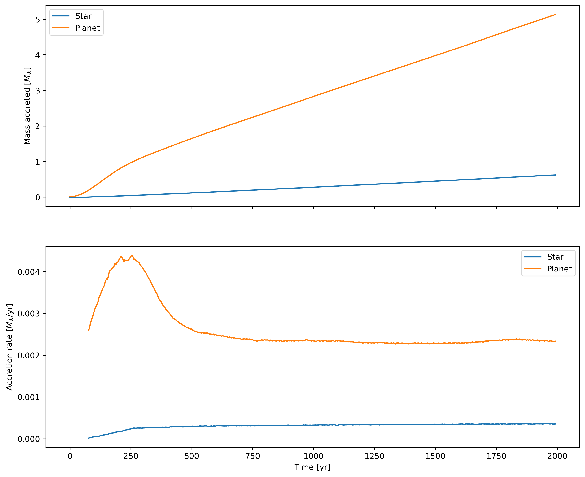

--------------------
Accretion onto sinks
--------------------

Plot mass accretion and accretion rate onto sink particles.

.. code-block:: pycon

    >>> import matplotlib.pyplot as plt
    >>> import numpy as np
    >>> import plonk

    # Set Seaborn plot style
    >>> plt.style.use('seaborn')

    # Load simulation
    >>> sim = plonk.load_sim(prefix='disc')
    >>> sink_labels = ('Star', 'Planet')

    # Initialize figure
    >>> fig, ax = plt.subplots(ncols=1, nrows=2, figsize=(12, 10))

    # Loop over sinks and plot
    >>> for idx, sink in enumerate(sim.sink_quantities):
    ...     sink['accretion_rate'] = np.gradient(sink['mass_accreted'], sink['time'])
    ...     time = (sink['time'].to_numpy() * sim.units['time']).to('year').m
    ...     mass_accreted = (
    ...         (sink['mass_accreted'].to_numpy() * sim.units['mass'])
    ...         .to('earth_mass')
    ...         .magnitude
    ...     )
    ...     accretion_rate = (
    ...         sink['accretion_rate'].rolling(window=100).mean().to_numpy()
    ...         * sim.units['mass']
    ...         / sim.units['time']
    ...     ).to('earth_mass / year').magnitude
    ...     ax[0].plot(time, mass_accreted, label=f'{sink_labels[idx]}')
    ...     ax[1].plot(time, accretion_rate)

    # Set plot labels
    >>> ax[0].set_xlabel('Time [yr]')
    >>> ax[0].set_ylabel('Mass accreted [$M_{\oplus}$]')
    >>> ax[0].legend()
    >>> ax[1].set_xlabel('Time [yr]')
    >>> ax[1].set_ylabel('Accretion rate [$M_{\oplus}$/yr]')

    >>> plt.show()

