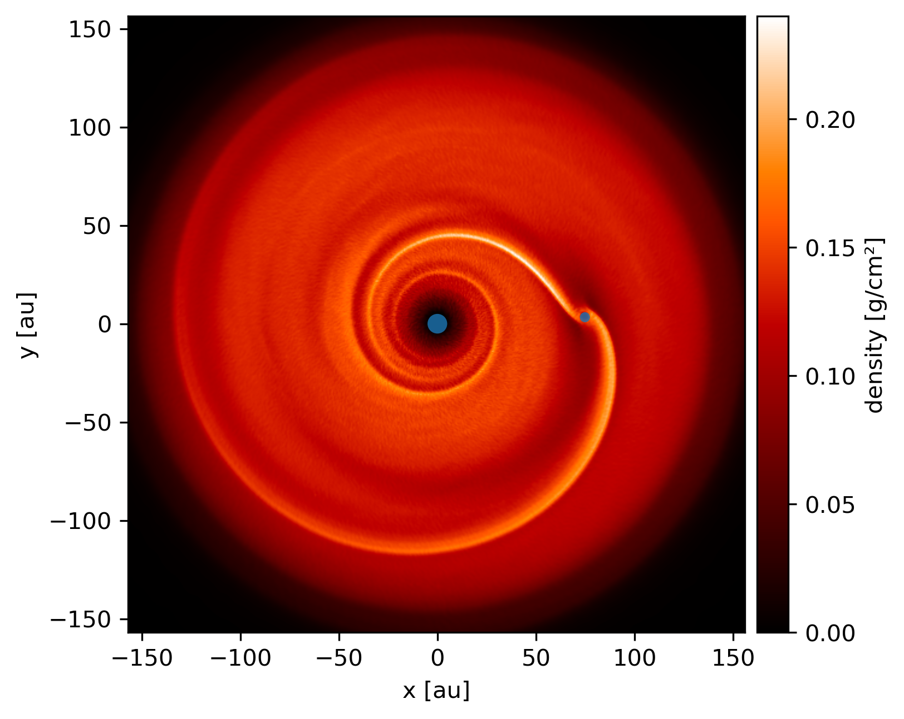

----------------
Accretion radius
----------------

Plot the accretion radius on the sink particles.

.. code-block:: python

    import plonk
    from plonk import visualize

    snap = plonk.load_snap('disc_00030.h5')

    # Sink particle indices are [0, 1]
    indices = [0, 1]

    units = {'position': 'au', 'density': 'g/cm^3', 'projection': 'cm'}

    ax = snap.image('density', units=units, cmap='gist_heat')

    visualize.plot_smoothing_length(
        snap=snap.sinks,
        indices=indices,
        units=units['position'],
        fac=1,
        alpha=0.8,
        ax=ax,
    )
