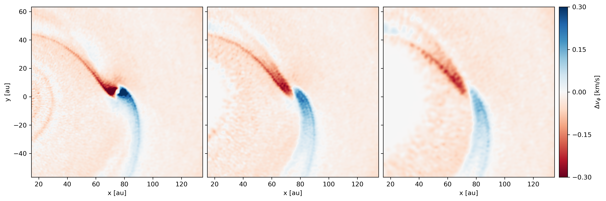

------------------------
Deviation from Keplerian
------------------------

Plot deviation from Keplerian velocity around planet.

.. note::

    The data is from a Phantom simulation with a single dust species using the
    separate particles (or "2-fluid") method with an embedded planet.

.. code-block:: python

    import matplotlib.pyplot as plt
    import numpy as np
    import plonk
    from mpl_toolkits.axes_grid1 import AxesGrid

    au = plonk.units('au')
    km_s = plonk.units('km/s')

    # Index of sink particles
    star_index = 0
    planet_index = 1

    # Altitudes for slices
    z_slices = (0.0, 5.0, 10.0) * au

    # Maximum velocity (km/s)
    velocity_max = 0.3 * km_s

    # Width for plot
    window_width = 120 * au

    # Load data
    snap = plonk.load_snap('disc_00030.h5')

    # Set default units
    snap.set_units(position='au', velocity='km/s')

    # Star and planet
    star = snap.sinks[star_index]
    planet = snap.sinks[planet_index]

    # Set window around planet for plot
    extent = (
        planet['x'] - window_width / 2,
        planet['x'] + window_width / 2,
        planet['y'] - window_width / 2,
        planet['y'] + window_width / 2,
    )

    @snap.add_array()
    def delta_keplerian(snap):
        """Deviation from Keplerian velocity."""
        G = plonk.units.gravitational_constant
        M_star = star['mass']
        v_k = np.sqrt(G * M_star / snap['R'] ** 3)
        return ((snap['v_phi'] - v_k) * snap['R']).to_base_units()

    # Set units for plot
    snap.set_units(position='au', delta_keplerian='km/s')

    # Generate figure and grid
    fig = plt.figure(figsize=(15, 5))
    grid = AxesGrid(
        fig,
        111,
        nrows_ncols=(1, 3),
        axes_pad=0.1,
        cbar_mode='single',
        cbar_location='right',
        cbar_pad=0.1,
    )

    # Focus on deviation from Keplerian of gas
    gas = snap['gas']

    # Loop over z-slices
    for slice_offset, ax in zip(z_slices, grid):
        gas.image(
            quantity='delta_keplerian',
            extent=extent,
            interp='slice',
            slice_offset=slice_offset,
            vmin=-velocity_max,
            vmax=velocity_max,
            cmap='RdBu',
            show_colorbar=False,
            ax=ax,
        )
        # Plot planet marker
        ax.plot(planet['x'].to('au').m, planet['y'].to('au').m, 'o', color='gray')

    # Add colorbar
    cbar = grid.cbar_axes[0].colorbar(ax.images[0])
    cbar.set_label_text(r'$\Delta v_{\phi}$ [km/s]')
