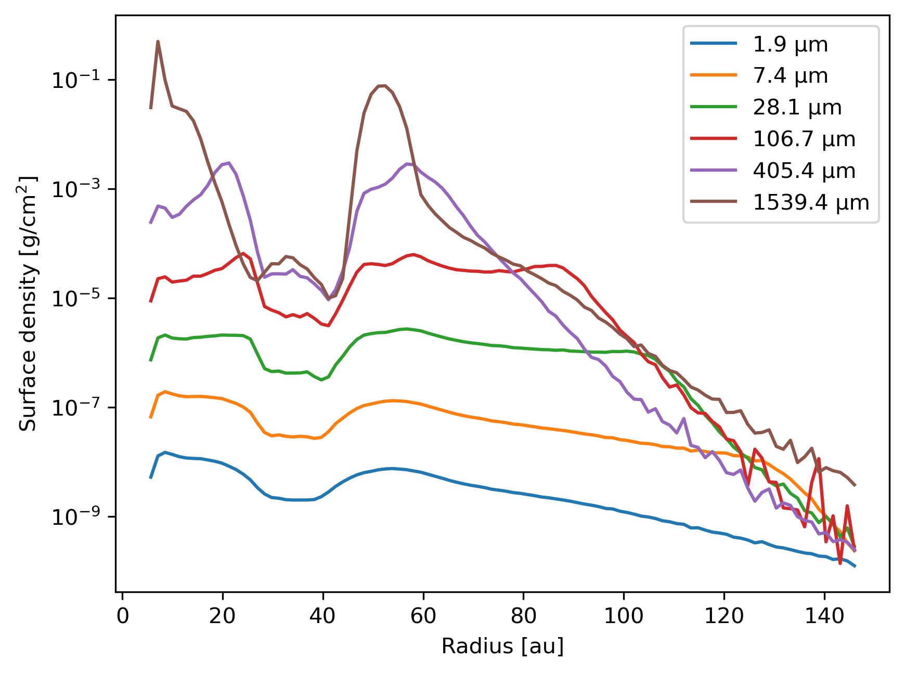

-------------
Dust profiles
-------------

Plot the dust density profile per species.

.. note::

    The data is from a Phantom snapshot with multiple dust species using the
    mixture (or "1-fluid") method. I.e., the particles carry a mixture of dust
    and gas.

.. code-block:: python

    import plonk

    snap = plonk.load_snap('dstau2mj_00130.h5')

    prof = plonk.load_profile(snap)

    prof.set_units(position='au', dust_density='g/cm^3')

    # The line below produces a list of strings like:
    #   ['dust_density_001',
    #    'dust_density_002',
    #    'dust_density_003',
    #    'dust_density_004',
    #    'dust_density_005',
    #    'dust_density_006']
    y = [f'dust_density_{n+1:03}' for n in range(snap.num_dust_species)]

    ax = prof.plot(x='radius', y=y, ax_kwargs={'yscale': 'log'})
