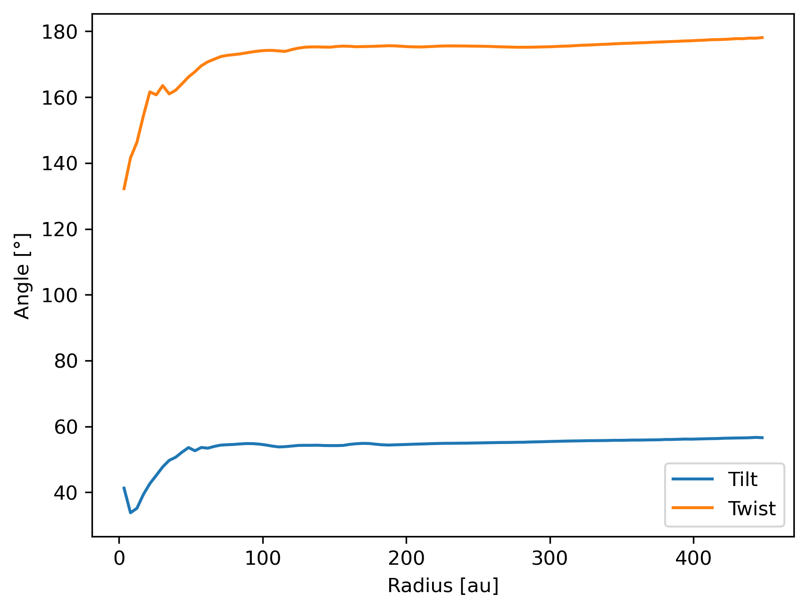

----------------------
Misaligned binary disc
----------------------

Plot the column density, kinematics, and tilt and twist of a disc around a
binary.

.. note::

    The data is from a Phantom gas simulation of a disc around a misaligned
    binary.

.. code-block:: python

    import plonk

    snap = plonk.load_snap('disc_00060.h5')

    snap.set_units(density='g/cm^3', position='au', projection='cm', velocity='km/s')

    # Plot column density and add sinks
    ax = snap.image(quantity='density', cmap='gist_heat', norm='log', vmin=3e-3)
    snap.sinks.plot(color='green', ax=ax)

    # Plot kinematics, i.e. z-velocity
    ax = snap.image(
        quantity='velocity_z',
        interp='slice',
        cmap='RdBu',
        vmin=-1,
        vmax=1,
        colorbar_kwargs={'extend': 'both'},
    )

    # Plot tilt and twist as radial profile
    prof = plonk.load_profile(snap, cmax='450 au')
    prof.set_units(
        position='au',
        angular_momentum_theta='degrees',
        angular_momentum_phi='degrees',
    )
    prof.plot(
        x='radius',
        y=['angular_momentum_theta', 'angular_momentum_phi'],
        label=['Tilt', 'Twist'],
        ax_kwargs={'ylabel': 'Angle [°]'},
    )
