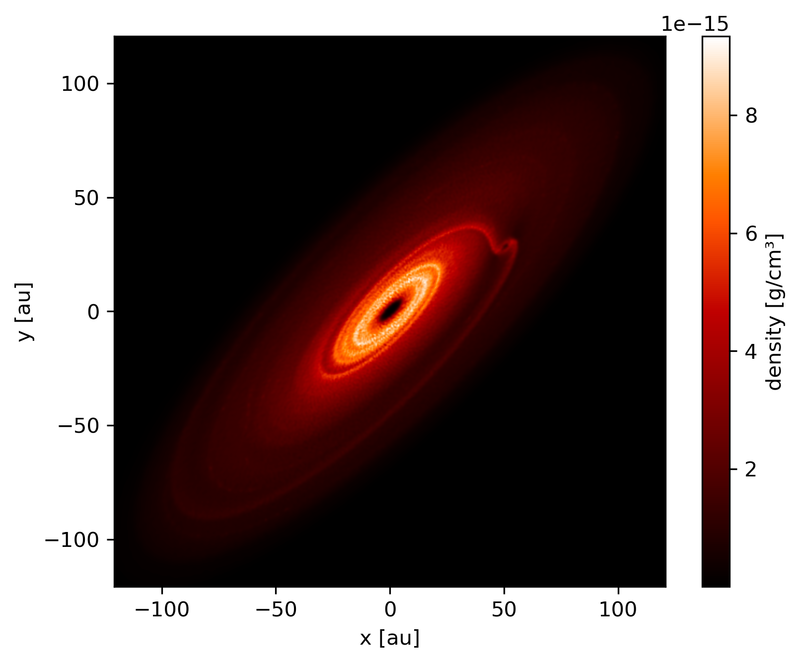

---------------
Rotate snapshot
---------------

Rotate a snapshot and plot column density and density cross-section in the disc
plane.

.. code-block:: python

    import matplotlib.pyplot as plt
    import numpy as np
    import plonk
    from plonk import analysis

    # Load the snapshot
    snap = plonk.load_snap('disc_00030.h5')

    # Define a rotation axis and angle
    angle = np.pi / 2.5
    axis = [1, 1, 0]

    # Apply the rotation to the snapshot
    snap.rotate(axis=axis, angle=angle)

    # Plot projection
    snap.image(quantity='density', cmap='gist_heat', units={'extent': 'au'})

    # Plot cross-section in the disc plane
    slice_normal = analysis.discs.normal(snap=snap)
    snap.plot(
        quantity='density',
        interp='cross_section',
        slice_normal=slice_normal,
        cmap='gist_heat',
        units={'extent': 'au'},
    )

    plt.show()

.. figure:: ../_static/rotate.png

