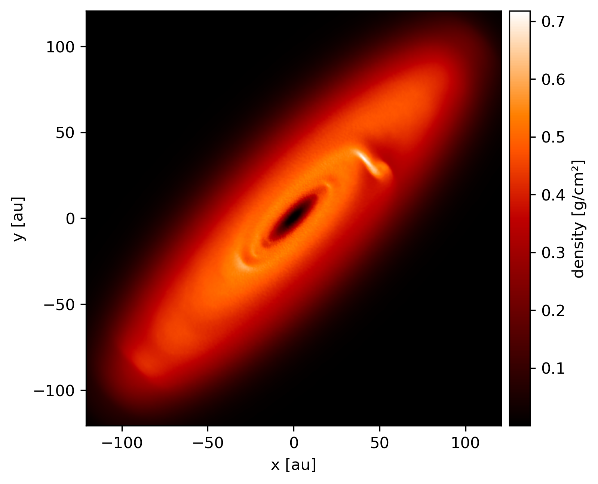

---------------
Rotate snapshot
---------------

Rotate a snapshot and plot column density.

.. code-block:: pycon

    >>> import matplotlib.pyplot as plt
    >>> import numpy as np
    >>> import plonk
    >>> from scipy.spatial.transform import Rotation

    # Load the snapshot
    >>> snap = plonk.load_snap('disc_00030.h5')

    # Define a rotation vector via scipy.spatial.transform
    >>> rotation_angle = np.pi / 2.5
    >>> rotation_vector = np.array([1, 1, 0])
    >>> rotation_vector = rotation_vector / np.linalg.norm(rotation_vector)
    >>> rotation = Rotation.from_rotvec(rotation_angle * rotation_vector)

    # Apply the rotation to the snapshot
    >>> snap.rotate(rotation)

    # Plot
    >>> plonk.visualize.plot(
    ...     snap=snap,
    ...     quantity='density',
    ...     extent=(-150, 150, -150, 150),
    ...     cmap='gist_heat',
    ... )
    >>> plt.show()

