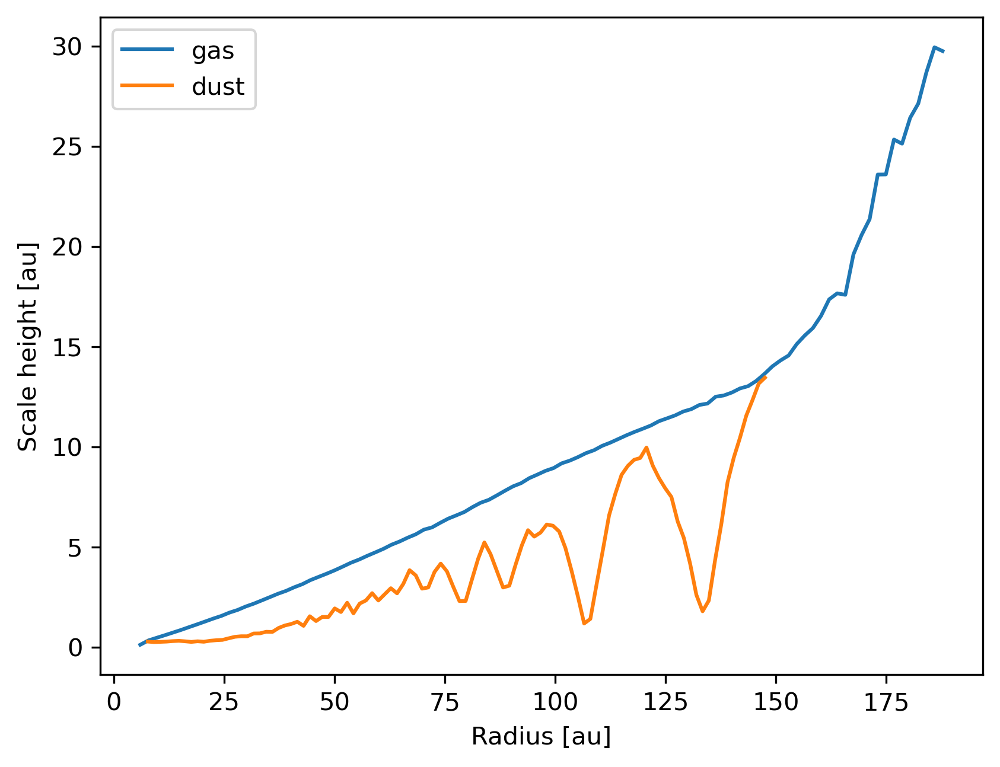

----------------------------
Scale height of dust and gas
----------------------------

Plot the dust and gas scale heights.

.. note::

    The data is from a Phantom simulation with a single dust species using the
    separate particles (or "2-fluid") method with an embedded planet.

.. code-block:: python

    import matplotlib.pyplot as plt
    import plonk

    snap = plonk.load_snap('disc_00030.h5')

    subsnaps = snap.subsnaps_as_dict(squeeze=True)

    profs = {family: plonk.load_profile(subsnap) for family, subsnap in subsnaps.items()}

    fig, ax = plt.subplots()

    for label, prof in profs.items():
        prof.set_units(position='au', scale_height='au')
        prof.plot('radius', 'scale_height', label=label, ax=ax)

    ax.set_ylabel('Scale height [au]')
