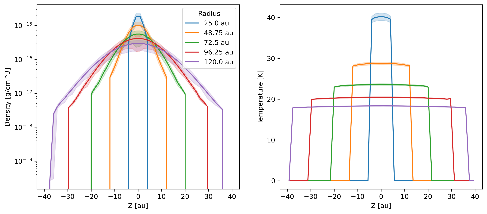

--------------------------
Vertical profile in a disc
--------------------------

Calculate and plot the density and temperature vertical profiles at multiple
radii in a disc.

.. note::

    The data is from a Phantom simulation with a single dust species using the
    separate particles (or "2-fluid") method with an embedded planet.

.. code-block:: python

    import matplotlib.pyplot as plt
    import numpy as np
    import plonk
    from plonk import analysis

    au = plonk.units('au')

    # Load snapshot
    snap = plonk.load_snap('disc_00030.h5')

    # Set molecular weight for temperature
    snap.set_molecular_weight(2.381)

    # Choose radii at which to calculate z-profiles and thickness
    radius = np.linspace(25, 120, 5) * au
    dR = 2.0 * au

    # Vertical height
    vertical_height = 40 * au

    # Plot units
    snap.set_units(position='au', density='g/cm^3', temperature='K')

    # Make figure and axes
    fig, axs = plt.subplots(ncols=2, figsize=(12, 5))

    # Loop over radius
    for R in radius:

        # Generate an annulus SubSnap
        subsnap = analysis.filters.annulus(
            snap=snap,
            radius_min=R - dR,
            radius_max=R + dR,
            height=1000 * au,
        )

        # Create vertical profile
        prof = plonk.load_profile(
            subsnap,
            ndim=1,
            coordinate='z',
            cmin=-vertical_height,
            cmax=vertical_height,
            n_bins=50,
        )

        # Plot density
        ax_kwargs = {
            'xlabel': 'Altitude [au]',
            'ylabel': r'Density [g/cm${}^3$]',
            'yscale': 'log'
        }
        prof.plot(
            x='z',
            y='density',
            std='shading',
            label=f'{R:~P}',
            ax_kwargs=ax_kwargs,
            ax=axs[0],
        )

        # Plot temperature
        ax_kwargs = {
            'xlabel': 'Altitude [au]',
            'ylabel': 'Temperature [K]',
            'yscale': 'linear'
        }
        prof.plot(
            x='z',
            y='temperature',
            std='shading',
            label=f'{R:~P}',
            ax_kwargs=ax_kwargs,
            ax=axs[1],
        )

    axs[0].legend(title='Radius', loc='upper right')
    axs[1].legend().remove()
