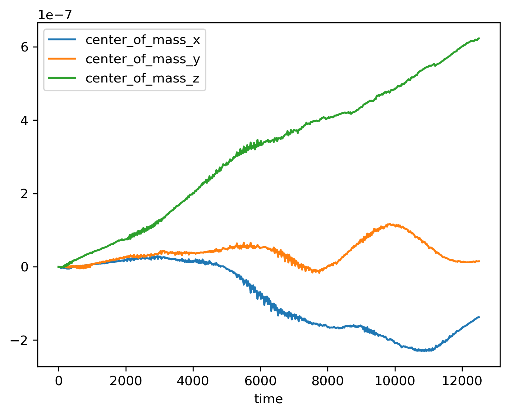

# Working with SPH data

```{eval-rst}
.. currentmodule:: plonk
```

First import the Plonk package.

```pycon
>>> import plonk
```

We also import Matplotlib and NumPy, for later.

```pycon
>>> import matplotlib.pyplot as plt
>>> import numpy as np
```

## Snapshots

SPH snapshot files are represented by the {class}`Snap` class. This object
contains a properties dictionary, particle arrays, which are lazily loaded from
file. Here we demonstrate instantiating a {class}`Snap` object, and
accessing some properties and particle arrays.

First, we load the snapshot with the {func}`load_snap` function. You can
pass a string or {class}`pathlib.Path` object to point to the location of the
snapshot in the file system.

```pycon
>>> filename = 'disc_00030.h5'
>>> snap = plonk.load_snap(filename)
```

You can access arrays by their name passed in as a string.

```pycon
>>> snap['position']
array([[-3.69505001e+12,  7.42032967e+12, -7.45096980e+11],
       [-1.63052677e+13,  1.16308971e+13,  1.92879212e+12],
       [-7.66283930e+12,  1.62532232e+13,  2.34302988e+11],
       ...,
       [ 1.39571712e+13, -1.16179990e+13,  8.09090354e+11],
       [ 9.53716176e+12,  9.98500386e+12,  4.93933367e+11],
       [ 1.21421196e+12,  2.08618956e+13,  1.12998892e+12]]) <Unit('meter')>
```

There may be a small delay as the data is read from file. After the array is
read from file it is cached in memory, so that subsequent calls are faster.

To see what arrays are loaded into memory you can use the
{meth}`~Snap.loaded_arrays` method.

```pycon
>>> snap.loaded_arrays()
['position']
```

Use {meth}`~Snap.available_arrays` to see what arrays are available. Some of
these arrays are stored on file, while others are computed as required.

```pycon
>>> snap.available_arrays()
['angular_momentum',
 'angular_velocity',
 'azimuthal_angle',
 'density',
 'dust_to_gas_ratio',
 'id',
 'kinetic_energy',
 'mass',
 'momentum',
 'polar_angle',
 'position',
 'pressure',
 'radius_cylindrical',
 'radius_spherical',
 'smoothing_length',
 'sound_speed',
 'specific_angular_momentum',
 'specific_kinetic_energy',
 'stopping_time',
 'sub_type',
 'temperature',
 'timestep',
 'type',
 'velocity',
 'velocity_divergence',
 'velocity_radial_cylindrical',
 'velocity_radial_spherical']
```

You can also define your own alias to access arrays. For example, if you prefer
to use the name `'coordinate'` rather than `'position',` use the
{meth}`~Snap.add_alias` method to add an alias.

```pycon
>>> snap.add_alias(name='position', alias='coordinate')
>>> snap['coordinate']
array([[-3.69505001e+12,  7.42032967e+12, -7.45096980e+11],
       [-1.63052677e+13,  1.16308971e+13,  1.92879212e+12],
       [-7.66283930e+12,  1.62532232e+13,  2.34302988e+11],
       ...,
       [ 1.39571712e+13, -1.16179990e+13,  8.09090354e+11],
       [ 9.53716176e+12,  9.98500386e+12,  4.93933367e+11],
       [ 1.21421196e+12,  2.08618956e+13,  1.12998892e+12]]) <Unit('meter')>
```

The {class}`Snap` object has a {attr}`~Snap.properties` attribute which is a
dictionary of metadata, i.e. non-array data, on the snapshot.

```pycon
>>> snap.properties['time']
61485663602.558136 <Unit('second')>

>>> list(snap.properties)
['adiabatic_index',
 'dust_method',
 'equation_of_state',
 'grain_density',
 'grain_size',
 'smoothing_length_factor',
 'time']
```

Units are available. We make use of the Python units library [Pint](https://pint.readthedocs.io/). The code
units of the data are available as {attr}`~Snap.code_units`.

```pycon
>>> snap.code_units['length']
149600000000.0 <Unit('meter')>
```

You can set default units as follows.

```pycon
>>> snap.set_units(position='au', density='g/cm^3', velocity='km/s')
<plonk.Snap "disc_00030.h5">

>>> snap['position']
array([[ -24.6998837 ,   49.60184016,   -4.98066567],
       [-108.99398271,   77.74774493,   12.89317897],
       [ -51.22291689,  108.64608658,    1.56621873],
       ...,
       [  93.29792694,  -77.66152625,    5.40843496],
       [  63.75198868,   66.74562821,    3.30174062],
       [   8.11650561,  139.453159  ,    7.55350939]]) <Unit('astronomical_unit')>
```

Sink particles are handled separately from the fluid, e.g. gas or dust,
particles. They are available as an attribute {attr}`~Snap.sinks`.

```pycon
>>> snap.sinks
<plonk.snap sinks>

>>> sinks = snap.sinks

>>> sinks.available_arrays()
['accretion_radius',
 'last_injection_time',
 'mass',
 'mass_accreted',
 'position',
 'softening_radius',
 'spin',
 'velocity']

>>> sinks['spin']
array([[ 3.56866999e+36, -1.17910663e+37,  2.44598074e+40],
       [ 4.14083556e+36,  1.19118555e+36,  2.62569386e+39]]) <Unit('kilogram * meter ** 2 / second')>
```

## Simulation

SPH simulation data is usually spread over multiple files of, possibly,
different types, even though, logically, a simulation is a singular "object".
Plonk has the {class}`Simulation` class to represent the complete data set.
{class}`Simulation` is an aggregation of the {class}`Snap` and pandas {class}`DataFrame <pandas:pandas.DataFrame>`s
to represent time series data (see below), plus metadata, such as the directory
on the file system.

Use the {func}`load_simulation` function to instantiate a {class}`Simulation`
object.

```pycon
>>> prefix = 'disc'
>>> sim = plonk.load_simulation(prefix=prefix)
```

Each of the snapshots are available via {attr}`~Simulation.snaps` as a list. We
can get the first five snapshots with the following.

```pycon
>>> sim.snaps[:5]
[<plonk.Snap "disc_00000.h5">,
 <plonk.Snap "disc_00001.h5">,
 <plonk.Snap "disc_00002.h5">,
 <plonk.Snap "disc_00003.h5">,
 <plonk.Snap "disc_00004.h5">]
```

The {class}`Simulation` class has an attribute {attr}`~Simulation.time_series`
which contains time series data as a pandas {class}`DataFrame <pandas:pandas.DataFrame>` discussed in the next
section.

## Time series

SPH simulation datasets often include auxiliary files containing
globally-averaged time series data output more frequently than snapshot files.
For example, Phantom writes text files with the file extension ".ev". These
files are output every time step rather than at the frequency of the snapshot
files.

We store this data in a pandas {class}`DataFrame <pandas:pandas.DataFrame>`. Use {func}`load_time_series` to
instantiate.

```pycon
>>> ts = plonk.load_time_series('disc01.ev')
```

The data may be split over several files, for example, if the simulation was run
with multiple jobs on a computation cluster. In that case, pass in a list of
files in chronological order to {func}`load_time_series`, and Plonk will
concatenate the data removing any duplicated time steps.

The underlying data is stored as a pandas [^f1] {class}`DataFrame <pandas:pandas.DataFrame>`. This allows for
the use of typical pandas operations with which users in the scientific Python
community may be familiar with.

```pycon
>>> ts
             time  energy_kinetic  energy_thermal  ...  gas_density_average  dust_density_max  dust_density_average
0        0.000000        0.000013        0.001186  ...         8.231917e-10      1.720023e-10          8.015937e-12
1        1.593943        0.000013        0.001186  ...         8.229311e-10      1.714059e-10          8.015771e-12
2        6.375774        0.000013        0.001186  ...         8.193811e-10      1.696885e-10          8.018406e-12
3       25.503096        0.000013        0.001186  ...         7.799164e-10      1.636469e-10          8.061417e-12
4       51.006191        0.000013        0.001186  ...         7.249247e-10      1.580470e-10          8.210622e-12
..            ...             ...             ...  ...                  ...               ...                   ...
548  12394.504462        0.000013        0.001186  ...         6.191121e-10      1.481833e-09          2.482929e-11
549  12420.007557        0.000013        0.001186  ...         6.189791e-10      1.020596e-09          2.483358e-11
550  12445.510653        0.000013        0.001186  ...         6.188052e-10      8.494835e-10          2.488946e-11
551  12471.013748        0.000013        0.001186  ...         6.186160e-10      6.517475e-10          2.497029e-11
552  12496.516844        0.000013        0.001186  ...         6.184558e-10      5.205011e-10          2.506445e-11

[553 rows x 21 columns]
```

You can plot columns with the pandas plotting interface.

```pycon
>>> ts.plot('time', ['center_of_mass_x', 'center_of_mass_y', 'center_of_mass_z'])
```

The previous code produces the following figure.



[^f1]: See [https://pandas.pydata.org/](https://pandas.pydata.org/) for more on pandas.
