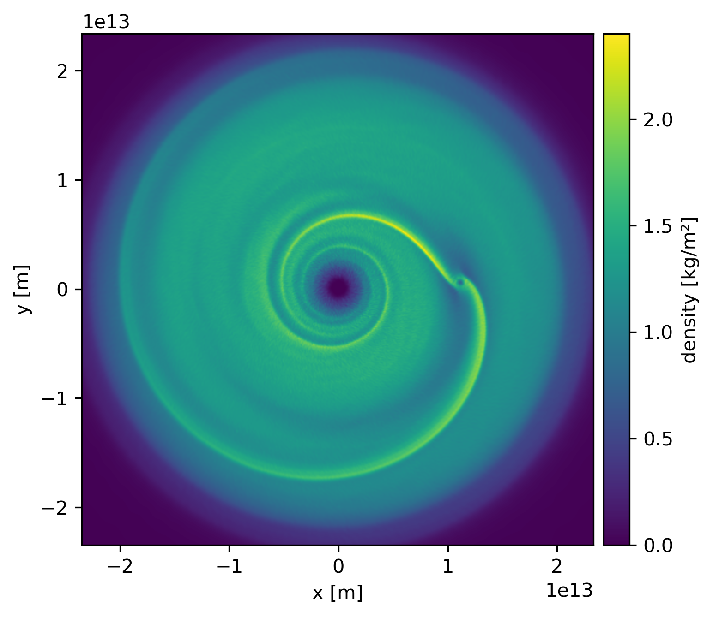
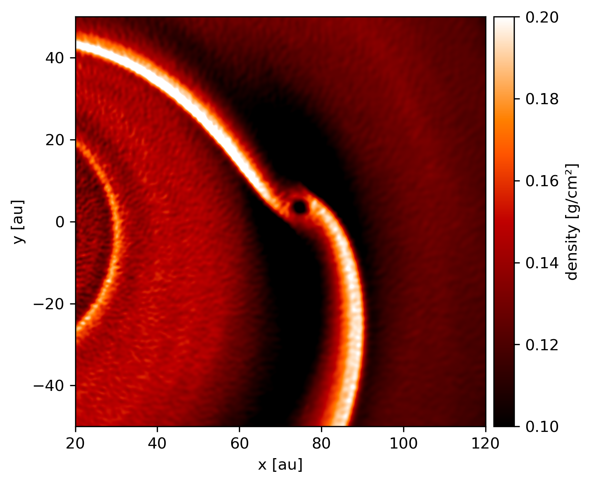

========
Overview
========

This document gives an overview of using Plonk for analysis and visualization of
smoothed particle hydrodynamics data. For a quickstart guide see
:doc:`quickstart`.

-----------------
Data file formats
-----------------

Plonk supports the following SPH file formats:

* Phantom output in
  `HDF <https://en.wikipedia.org/wiki/Hierarchical_Data_Format>`_
  form (as opposed to the sphNG-based Fortran binary format).

.. note::
    HDF5 output was added to Phantom as an option with git commit
    `9b22ded <https://github.com/danieljprice/phantom/commit/9b22ded9e7b4d512966f2b2e4b84d693b1afc9e6>`_
    on the 14th of March 2019. See the `Phantom documentation
    <https://phantomsph.readthedocs.io/>`_ for instructions on
    how to compile with HDF5 output and to convert from the sphNG-based
    output.

---------------------
Working with SPH data
---------------------

.. important::
    To follow along, download the sample data, :code:`plonk_example_data.tar`,
    from `Anaconda Cloud <https://anaconda.org/dmentipl/plonk_example_data/>`_.
    Then extract with :code:`tar xvf plonk_example_data.tar` and change into the
    :code:`plonk_example_data` directory. This data set is from a Phantom
    simulation of a dust and gas protoplanetary disc with an embedded
    protoplanet.

First import the Plonk package.

.. code-block:: pycon

    >>> import plonk

We also import Matplotlib and NumPy, for later.

.. code-block:: pycon

    >>> import matplotlib.pyplot as plt
    >>> import numpy as np

~~~~~~~~~
Snapshots
~~~~~~~~~

SPH snapshot files are represented by the :py:class:`Snap` class. This object
contains a properties dictionary, particle arrays, which are lazily loaded from
file. Here we demonstrate instantiating a :py:class:`Snap` object, and accessing
some properties and particle arrays.

First, we load the snapshot with the :py:func:`load_snap` function. You can
pass a string or :class:`pathlib.Path` object to point to the location of the
snapshot in the file system.

.. code-block:: pycon

    >>> filename = 'disc_00030.h5'
    >>> snap = plonk.load_snap(filename)

You can access arrays by their name passed in as a string.

.. code-block:: pycon

    >>> snap['position']
    array([[-3.69505001e+14,  7.42032967e+14, -7.45096980e+13],
           [-1.63052677e+15,  1.16308971e+15,  1.92879212e+14],
           [-7.66283930e+14,  1.62532232e+15,  2.34302988e+13],
           ...,
           [ 1.39571712e+15, -1.16179990e+15,  8.09090354e+13],
           [ 9.53716176e+14,  9.98500386e+14,  4.93933367e+13],
           [ 1.21421196e+14,  2.08618956e+15,  1.12998892e+14]]) <Unit('centimeter')>

There may be a small delay as the data is read from file. After the array is
read from file it is cached in memory, so that subsequent calls are faster.

To see what arrays are loaded into memory you can use the
:py:meth:`loaded_arrays` method.

.. code-block:: pycon

    >>> snap.loaded_arrays()
    ('position',)

Use :py:meth:`available_arrays` to see what arrays are available. Some of these
arrays are stored on file, while others are computed as required.

.. code-block:: pycon

    >>> snap.available_arrays()
    ('density',
     'dust_to_gas_ratio',
     'mass',
     'position',
     'pressure',
     'smoothing_length',
     'sound_speed',
     'stopping_time',
     'sub_type',
     'timestep',
     'type',
     'velocity',
     'velocity_divergence')

You can also define your own alias to access arrays. For example, if you prefer
to use the name `'coordinate'` rather than `'position',` use the
:py:meth:`add_alias` method to add an alias.

.. code-block:: pycon

    >>> snap.add_alias(name='position', alias='coordinate')
    >>> snap['coordinate']
    array([[-3.69505001e+14,  7.42032967e+14, -7.45096980e+13],
           [-1.63052677e+15,  1.16308971e+15,  1.92879212e+14],
           [-7.66283930e+14,  1.62532232e+15,  2.34302988e+13],
           ...,
           [ 1.39571712e+15, -1.16179990e+15,  8.09090354e+13],
           [ 9.53716176e+14,  9.98500386e+14,  4.93933367e+13],
           [ 1.21421196e+14,  2.08618956e+15,  1.12998892e+14]]) <Unit('centimeter')>

The :py:class:`Snap` object has a :py:attr:`properties` attribute which is a
dictionary of metadata, i.e. non-array data, on the snapshot.

.. code-block:: pycon

    >>> snap.properties['time']
    61485663602.558136 <Unit('second')>

    >>> list(snap.properties)
    ['adiabatic_index',
     'dust_method',
     'equation_of_state',
     'grain_density',
     'grain_size',
     'smoothing_length_factor',
     'time']

Units are available. We make use of the Python units library Pint.

.. code-block:: pycon

    >>> snap.units['length']
    14960000000000.0 <Unit('centimeter')>

Sink particles are handled separately from the fluid, e.g. gas or dust,
particles. They are available as an attribute.

.. code-block:: pycon

    >>> snap.available_sink_arrays()
    ('accretion_radius',
     'last_injection_time',
     'mass',
     'mass_accreted',
     'position',
     'softening_radius',
     'spin',
     'velocity')

    >>> snap.sinks
    <plonk.snap sinks>

    >>> snap.sinks['spin']
    array([[ 3.56866999e+43, -1.17910663e+44,  2.44598074e+47],
           [ 4.14083556e+43,  1.19118555e+43,  2.62569386e+46]]) <Unit('centimeter ** 2 * gram / second')>

~~~~~~~~~~
Simulation
~~~~~~~~~~

SPH simulation data is usually spread over multiple files of, possibly,
different types, even though, logically, a simulation is a singular "object".
Plonk has the :py:class:`Simulation` class to represent the complete data set.
:py:class:`Simulation` is an aggregation of the :py:class:`Snap` and
pandas DataFrames to represent time evolution data (see below) objects, plus
metadata, such as the directory on the file system.

Use the :py:func:`load_sim` function to instantiate a :py:class:`Simulation`
object.

.. code-block:: pycon

    >>> prefix = 'disc'
    >>> sim = plonk.load_sim(prefix=prefix)

Each of the snapshots are available via :py:attr:`snaps` as a list. We can get
the first five snapshots with the following.

.. code-block:: pycon

    >>> sim.snaps[:5]
    [<plonk.Snap "disc_00000.h5">,
     <plonk.Snap "disc_00001.h5">,
     <plonk.Snap "disc_00002.h5">,
     <plonk.Snap "disc_00003.h5">,
     <plonk.Snap "disc_00004.h5">]

The :py:class:`Simulation` class has attributes :py:attr:`global_quantities` and
:py:attr:`sink_quantities` which are pandas DataFrames discussed in the next
section.

~~~~~~~~~
Evolution
~~~~~~~~~

SPH simulation data also include auxiliary files containing globally-averaged
quantities output more frequently than snapshot files. For example, Phantom
writes text files with the suffix :code:`.ev`. These files are output every time
step rather than at the frequency of the snapshot files.

We store this data in pandas DataFrames. Use :py:meth:`load_ev` to instantiate.

.. code-block:: pycon

    >>> ev = plonk.load_ev('disc01.ev')

The data may be split over several files, for example, if the simulation was run
with multiple jobs on a computation cluster. In that case, pass in a tuple or
list of files in chronological order to :py:func:`load_ev`, and Plonk will
concatenate the data removing any duplicated time steps.

The underlying data is stored as a pandas [#f1]_ DataFrame. This allows for
the use of typical pandas operations with which users in the scientific Python
community may be familiar with.

.. code-block:: pycon

    >>> ev
                 time  energy_kinetic  energy_thermal  ...  gas_density_average  dust_density_max  dust_density_average
    0        0.000000        0.000013        0.001186  ...         8.231917e-10      1.720023e-10          8.015937e-12
    1        1.593943        0.000013        0.001186  ...         8.229311e-10      1.714059e-10          8.015771e-12
    2        6.375774        0.000013        0.001186  ...         8.193811e-10      1.696885e-10          8.018406e-12
    3       25.503096        0.000013        0.001186  ...         7.799164e-10      1.636469e-10          8.061417e-12
    4       51.006191        0.000013        0.001186  ...         7.249247e-10      1.580470e-10          8.210622e-12
    ..            ...             ...             ...  ...                  ...               ...                   ...
    548  12394.504462        0.000013        0.001186  ...         6.191121e-10      1.481833e-09          2.482929e-11
    549  12420.007557        0.000013        0.001186  ...         6.189791e-10      1.020596e-09          2.483358e-11
    550  12445.510653        0.000013        0.001186  ...         6.188052e-10      8.494835e-10          2.488946e-11
    551  12471.013748        0.000013        0.001186  ...         6.186160e-10      6.517475e-10          2.497029e-11
    552  12496.516844        0.000013        0.001186  ...         6.184558e-10      5.205011e-10          2.506445e-11

    [553 rows x 21 columns]

You can plot columns with the pandas plotting interface.

.. code-block:: pycon

    ev.plot('time', ['center_of_mass_x', 'center_of_mass_y', 'center_of_mass_z'])

The previous code produces the following figure.

.. figure:: _static/ev.png

    The accretion disc center of mass as a function of time.

-------------------------
Visualization of SPH data
-------------------------

SPH particle data is not gridded like the data produced by, for example, finite
difference or finite volume hydrodynamical codes. One visualization method is to
plot the particles as a scatter plot, and possibly color the particles with the
magnitude of a quantity of interest. An alternative is to interpolate any
quantity on the particles to a pixel grid with weighted kernel density
estimation. This is what `Splash <https://github.com/danieljprice/splash>`_
does. For the technical details, see Price (2007), `PASA, 24, 3, 159
<https://ui.adsabs.harvard.edu/abs/2007PASA...24..159P>`_. We use the same
numerical method as Splash, with the Python function compiled with Numba so it
has the same performance as the Fortran code.

You can use the :py:func:`visualize.plot` function to interpolate a quantity
to a pixel grid to show as an image. For example, in the following we produce a
plot of column density, i.e. a projection plot.

.. code-block:: pycon

    >>> ax = plonk.plot(snap=snap, quantity='density')

    The total column density.

This produces an image via Matplotlib. The function returns a Matplotlib
:py:class:`image.AxesImage` object. We can use that to manipulate the figure.
For example, we can change the colorbar limits.

.. code-block:: pycon

    >>> ax.images[0].set_clim(vmax=0.15)

Alternatively, you can pass keyword arguments to the matplotlib functions. For
example, we set the colormap to 'gist_heat' and set the colorbar minimum and
maxiumum. In addition, we set the extent, i.e. the x- and y-limits.

.. code-block:: pycon

    >>> au = plonk.units('au')
    >>> plonk.plot(
    ...     snap=snap,
    ...     quantity='density',
    ...     extent=(20, 120, -50, 50) * au,
    ...     cmap='gist_heat',
    ...     vmin=0.1,
    ...     vmax=0.2,
    ... )

    The column density zoomed around the planet.

More fine-grained control can be achieved by using the full details of
:py:func:`visualize.plot`. See the API for more details.

--------------------
Analysis of SPH data
--------------------

~~~~~~~~
Subsnaps
~~~~~~~~

When analyzing SPH data it can be useful to look at a subset of particles. For
example, the simulation we have been working with has dust and gas. So far we
have been plotting the total density. We may want to visualize the dust and gas
separately.

To do this we take a :py:class:`SubSnap`. We can use the tags 'gas' and 'dust'
to access those particles. Given that there may be sub-types of dust, using
'dust' returns a list. In this simulation there is only one dust species.

.. code-block:: pycon

    >>> gas = snap['gas']
    >>> dust = snap['dust'][0]

You can access arrays on the :py:class:`SubSnap` objects as for any
:py:class:`Snap` object.

.. code-block:: pycon

    >>> gas['mass']
    array([1.9891e+24, 1.9891e+24, 1.9891e+24, ..., 1.9891e+24, 1.9891e+24,
           1.9891e+24]) <Unit('gram')>
    >>> dust['mass']
    array([1.9891e+23, 1.9891e+23, 1.9891e+23, ..., 1.9891e+23, 1.9891e+23,
           1.9891e+23]) <Unit('gram')>

Let's plot the gas and dust side-by-side.

.. code-block:: pycon

    >>> subsnaps = [gas, dust]
    >>> extent = (-200, 200, -200, 200) * au

    >>> fig, axs = plt.subplots(ncols=2, figsize=(14, 5))

    >>> for subsnap, ax in zip(subsnaps, axs):
    ...     plonk.plot(
    ...         snap=subsnap,
    ...         quantity='density',
    ...         extent=extent,
    ...         cmap='gist_heat',
    ...         ax=ax,
    ...     )

.. figure:: _static/dust-gas.png

    The column density of the gas and dust.

~~~~~~~~~~~~~~
Derived arrays
~~~~~~~~~~~~~~

Sometimes you need new arrays on the particles that are not available in the
snapshot files. Many are available in Plonk already. To access these arrays use
the :py:meth:`extra_quantities` method. Before calling the method:

.. code-block:: pycon

    >>> snap.available_arrays()
    ('density',
     'dust_to_gas_ratio',
     'mass',
     'position',
     'pressure',
     'smoothing_length',
     'sound_speed',
     'stopping_time',
     'sub_type',
     'timestep',
     'type',
     'velocity',
     'velocity_divergence')

    >>> snap.extra_quantities()
    <plonk.Snap "disc_00030.h5">

After calling :py:meth:`extra_quantities`:

.. code-block:: pycon

    >>> snap.available_arrays()
    ('angular_momentum',
     'angular_velocity',
     'azimuthal_angle',
     'density',
     'dust_to_gas_ratio',
     'eccentricity',
     'inclination',
     'keplerian_frequency',
     'kinetic_energy',
     'mass',
     'momentum',
     'polar_angle',
     'position',
     'pressure',
     'radius_cylindrical',
     'radius_spherical',
     'semi_major_axis',
     'smoothing_length',
     'sound_speed',
     'specific_angular_momentum',
     'stokes_number',
     'stopping_time',
     'sub_type',
     'temperature',
     'timestep',
     'type',
     'velocity',
     'velocity_divergence',
     'velocity_radial_cylindrical',
     'velocity_radial_spherical')

You can create a new, derived array on the particles as follows.

.. code-block:: pycon

    >>> snap['rad'] = np.sqrt(snap['x'] ** 2 + snap['y'] ** 2)
    >>> snap['rad']
    array([8.28943225e+14, 2.00284678e+15, 1.79690392e+15, ...,
           1.81598604e+15, 1.38078875e+15, 2.08972008e+15]) <Unit('centimeter')>

Where, here, we have used the fact that Plonk knows that 'x' and 'y' refer to
the x- and y-components of the position array.

Alternatively, you can define a function for a derived array. This makes use of
the decorator :py:meth:`add_array`.

.. code-block:: pycon

    >>> @snap.add_array()
    ... def radius(snap):
    ...     radius = np.hypot(snap['x'], snap['y'])
    ...     return radius
    >>> snap['radius']
    array([8.28943225e+14, 2.00284678e+15, 1.79690392e+15, ...,
           1.81598604e+15, 1.38078875e+15, 2.08972008e+15]) <Unit('centimeter')>

~~~~~
Units
~~~~~

Plonk uses Pint to set arrays to physical units.

.. code-block:: pycon

    >>> snap = plonk.load_snap(filename)
    >>> snap['x']
    array([-3.69505001e+14, -1.63052677e+15, -7.66283930e+14, ...,
            1.39571712e+15,  9.53716176e+14,  1.21421196e+14]) <Unit('centimeter')>

It is easy to convert quantities to different units as required.

.. code-block:: pycon

    >>> snap['x'].to('au')
    array([ -24.6998837 , -108.99398271,  -51.22291689, ...,   93.29792694,
             63.75198868,    8.11650561]) <Unit('astronomical_unit')>

~~~~~~~~
Profiles
~~~~~~~~

Generating a profile is a convenient method to reduce the dimensionality
of the full data set. For example, we may want to see how the surface density
and aspect ratio of the disc vary with radius.

To do this we use the :py:class:`Profile` class in the :mod:`analysis`
module.

.. code-block:: pycon

    >>> snap = plonk.load_snap(filename)
    >>> prof = plonk.load_profile(snap, cmin='10 au', cmax='200 au')
    >>> prof
    <plonk.Profile "disc_00030.h5">

To see what profiles are loaded and what are available use the
:py:meth:`loaded_profiles` and :py:meth:`available_profiles` methods.

.. code-block:: pycon

    >>> prof.loaded_profiles()
    ('number', 'radius', 'size')

    >>> prof.available_profiles()
    ('angular_momentum_phi',
     'angular_momentum_theta',
     'aspect_ratio',
     'density',
     'dust_mass_001',
     'dust_surface_density_001',
     'dust_to_gas_ratio',
     'gas_mass',
     'gas_surface_density',
     'mass',
     'number',
     'position',
     'pressure',
     'radius',
     'scale_height',
     'size',
     'smoothing_length',
     'sound_speed',
     'stopping_time',
     'sub_type',
     'surface_density',
     'timestep',
     'toomre_Q',
     'type',
     'velocity',
     'velocity_divergence')

To load a profile, simply call it.

.. code-block:: pycon

    >>> prof['scale_height']
    array([7.97124951e+12, 9.84227660e+12, 1.18761140e+13, 1.37555034e+13,
           1.57492383e+13, 1.79386553e+13, 1.99666627e+13, 2.20898696e+13,
           2.46311866e+13, 2.63718852e+13, 2.91092881e+13, 3.11944125e+13,
           3.35101091e+13, 3.58479038e+13, 3.86137691e+13, 4.09731915e+13,
           4.34677739e+13, 4.61230912e+13, 4.87471032e+13, 5.07589421e+13,
           5.38769961e+13, 5.64068787e+13, 5.88487300e+13, 6.15197082e+13,
           6.35591229e+13, 6.75146081e+13, 6.94786320e+13, 7.32840731e+13,
           7.65750662e+13, 7.96047221e+13, 8.26764128e+13, 8.35658042e+13,
           8.57126522e+13, 8.99037935e+13, 9.26761324e+13, 9.45798955e+13,
           9.65997944e+13, 1.01555592e+14, 1.05554201e+14, 1.07641999e+14,
           1.10797835e+14, 1.13976869e+14, 1.17181502e+14, 1.20083661e+14,
           1.23779947e+14, 1.24785058e+14, 1.28800980e+14, 1.31290341e+14,
           1.33602542e+14, 1.34618607e+14, 1.36220344e+14, 1.39412340e+14,
           1.41778445e+14, 1.46713623e+14, 1.51140364e+14, 1.54496807e+14,
           1.58327631e+14, 1.60316504e+14, 1.63374960e+14, 1.64446331e+14,
           1.66063803e+14, 1.67890856e+14, 1.68505873e+14, 1.68507230e+14,
           1.71353612e+14, 1.71314330e+14, 1.75704484e+14, 1.79183025e+14,
           1.83696336e+14, 1.88823477e+14, 1.93080810e+14, 1.98301979e+14,
           2.05279086e+14, 2.11912539e+14, 2.14224572e+14, 2.21647741e+14,
           2.27153917e+14, 2.36605186e+14, 2.38922067e+14, 2.53901104e+14,
           2.61297334e+14, 2.64782574e+14, 2.73832897e+14, 3.04654121e+14,
           3.13575612e+14, 3.37636281e+14, 3.51482502e+14, 3.69591185e+14,
           3.88308614e+14, 3.83982313e+14, 4.00147149e+14, 4.37288049e+14,
           4.35330982e+14, 4.44686164e+14, 4.47133547e+14, 4.83307604e+14,
           4.63783507e+14, 4.95119779e+14, 5.17961431e+14, 5.29308491e+14]) <Unit('centimeter')>

You can convert the data in the :py:class:`Profile` object to a pandas DataFrame
with the :py:meth:`to_dataframe` method. This takes all loaded profiles and puts
them into the DataFrame.

.. code-block:: pycon

    >>> snap.extra_quantities()
    >>> profiles = (
    ...    'radius',
    ...    'angular_momentum_phi',
    ...    'angular_momentum_theta',
    ...    'surface_density',
    ...    'scale_height',
    ... )
    >>> df = prof.to_dataframe(columns=profiles)
    >>> df
         radius [cm]  angular_momentum_phi [rad]  angular_momentum_theta [rad]  surface_density [g / cm ** 2]  scale_height [cm]
    0   1.638097e+14                   -0.019731                      0.049709                       0.048601       7.971250e+12
    1   1.922333e+14                    1.914841                      0.053297                       0.063095       9.842277e+12
    2   2.206569e+14                    1.293811                      0.055986                       0.080842       1.187611e+13
    3   2.490805e+14                   -2.958286                      0.057931                       0.095611       1.375550e+13
    4   2.775041e+14                   -1.947547                      0.059679                       0.109594       1.574924e+13
    ..           ...                         ...                           ...                            ...                ...
    95  2.864051e+15                    3.045660                      0.168944                       0.001388       4.833076e+14
    96  2.892475e+15                   -0.054956                      0.161673                       0.001325       4.637835e+14
    97  2.920898e+15                   -0.217485                      0.169546                       0.001106       4.951198e+14
    98  2.949322e+15                   -1.305261                      0.175302                       0.001137       5.179614e+14
    99  2.977746e+15                    2.642077                      0.176867                       0.001066       5.293085e+14

    [100 rows x 5 columns]

We can also plot the profiles.

.. code-block:: pycon

    >>> with plt.style.context('seaborn'):
    ...     fig, axs = plt.subplots(ncols=2, figsize=(12, 5))
    ...     prof.plot('radius', 'surface_density', x_unit='au', y_unit='g/cm^2', ax=axs[0])
    ...     prof.plot('radius', 'scale_height', x_unit='au', y_unit='au', ax=axs[1])

.. figure:: _static/profile.png

.. rubric:: Footnotes

.. [#f1] See `<https://pandas.pydata.org/>`_ for more on pandas.
