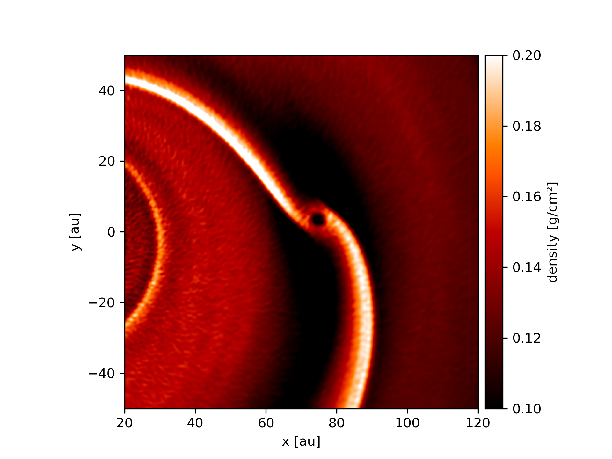

==========
Quickstart
==========

Quickstart guide for simple Plonk usage.

---------
Load data
---------

~~~~~~~~~~~~~
Load snapshot
~~~~~~~~~~~~~

Load a single snapshot, and access particle arrays and properties.

.. code-block:: python

    >>> import plonk

    >>> snap = plonk.load_snap('disc_00030.h5')

    >>> snap['position']
    array([[-3.69505001e+14,  7.42032967e+14, -7.45096980e+13],
           [-1.63052677e+15,  1.16308971e+15,  1.92879212e+14],
           [-7.66283930e+14,  1.62532232e+15,  2.34302988e+13],
           ...,
           [ 1.39571712e+15, -1.16179990e+15,  8.09090354e+13],
           [ 9.53716176e+14,  9.98500386e+14,  4.93933367e+13],
           [ 1.21421196e+14,  2.08618956e+15,  1.12998892e+14]]) <Unit('centimeter')>

    >>> snap['position'].to('au')
    array([[ -24.6998837 ,   49.60184016,   -4.98066567],
           [-108.99398271,   77.74774493,   12.89317897],
           [ -51.22291689,  108.64608658,    1.56621873],
           ...,
           [  93.29792694,  -77.66152625,    5.40843496],
           [  63.75198868,   66.74562821,    3.30174062],
           [   8.11650561,  139.453159  ,    7.55350939]]) <Unit('astronomical_unit')>

    >>> snap.properties['time']
    61485663602.558136 <Unit('second')>

~~~~~~~~~~~~~~~~~~~~~
Load auxilliary files
~~~~~~~~~~~~~~~~~~~~~

Load a Phantom `.ev` file, and see what columns are available.

.. code-block:: python

    >>> import plonk

    >>> ev = plonk.load_ev('disc01.ev')

    >>> ev.columns
    Index(['time', 'energy_kinetic', 'energy_thermal', 'energy_magnetic',
           'energy_potential', 'energy_total', 'momentum', 'angular_momentum',
           'density_max', 'density_average', 'timestep', 'entropy',
           'mach_number_rms', 'velocity_rms', 'center_of_mass_x',
           'center_of_mass_y', 'center_of_mass_z', 'gas_density_max',
           'gas_density_average', 'dust_density_max', 'dust_density_average'],
          dtype='object')

~~~~~~~~~~~~~~~
Load simulation
~~~~~~~~~~~~~~~

Load a simulation, and access snapshots and other data.

.. code-block:: python

    >>> import plonk

    >>> sim = plonk.load_sim(prefix='disc')

    >>> snaps = sim.snaps
    [<plonk.Snap "disc_00000.h5">,
     <plonk.Snap "disc_00001.h5">,
     <plonk.Snap "disc_00002.h5">,
     <plonk.Snap "disc_00003.h5">,
     <plonk.Snap "disc_00004.h5">,
     <plonk.Snap "disc_00005.h5">,
     <plonk.Snap "disc_00006.h5">,
     <plonk.Snap "disc_00007.h5">,
     <plonk.Snap "disc_00008.h5">,
     <plonk.Snap "disc_00009.h5">,
     <plonk.Snap "disc_00010.h5">,
     <plonk.Snap "disc_00011.h5">,
     <plonk.Snap "disc_00012.h5">,
     <plonk.Snap "disc_00013.h5">,
     <plonk.Snap "disc_00014.h5">,
     <plonk.Snap "disc_00015.h5">,
     <plonk.Snap "disc_00016.h5">,
     <plonk.Snap "disc_00017.h5">,
     <plonk.Snap "disc_00018.h5">,
     <plonk.Snap "disc_00019.h5">,
     <plonk.Snap "disc_00020.h5">,
     <plonk.Snap "disc_00021.h5">,
     <plonk.Snap "disc_00022.h5">,
     <plonk.Snap "disc_00023.h5">,
     <plonk.Snap "disc_00024.h5">,
     <plonk.Snap "disc_00025.h5">,
     <plonk.Snap "disc_00026.h5">,
     <plonk.Snap "disc_00027.h5">,
     <plonk.Snap "disc_00028.h5">,
     <plonk.Snap "disc_00029.h5">,
     <plonk.Snap "disc_00030.h5">]

    >>> sim.global_quantities
    # Output is a pandas DataFrame

    >>> sim.sink_quantities
    # Output is a list of pandas DataFrames

-------------
Visualization
-------------

~~~~~~~~~~~~~~~
Projection plot
~~~~~~~~~~~~~~~

Produce a projection image plot of density.

.. code-block:: python

    >>> import plonk

    >>> snap = plonk.load_snap('disc_00030.h5')

    >>> au = plonk.units('au')

    >>> plonk.visualize.plot(
    ...    snap=snap,
    ...    quantity='density',
    ...    extent=(-150, 150, -150, 150) * au,
    ...    units={'quantity': 'g/cm^3', 'extent': 'au', 'projection': 'cm'},
    ...    cmap='gist_heat',
    ... )

--------
Analysis
--------

~~~~~~~
Profile
~~~~~~~

Create a radial profile.

.. code-block:: python

    >>> import matplotlib.pyplot as plt
    >>> import plonk

    >>> snap = plonk.load_snap('disc_00030.h5')

    >>> prof = plonk.load_profile(snap)

    >>> prof.available_profiles()
    ('angular_momentum_phi',
     'angular_momentum_theta',
     'aspect_ratio',
     'density',
     'dust_mass_001',
     'dust_surface_density_001',
     'dust_to_gas_ratio',
     'gas_mass',
     'gas_surface_density',
     'mass',
     'number',
     'position',
     'pressure',
     'radius',
     'scale_height',
     'size',
     'smoothing_length',
     'sound_speed',
     'stopping_time',
     'sub_type',
     'surface_density',
     'timestep',
     'toomre_Q',
     'type',
     'velocity',
     'velocity_divergence')

    >>> with plt.style.context('seaborn'):
    ...     ax = prof.plot('radius', 'scale_height', x_unit='au', y_unit='au')
    ...     ax.set_xlabel('Radius [au]')
    ...     ax.set_ylabel('Scale height [au]')

.. image:: _static/scale_height.png
