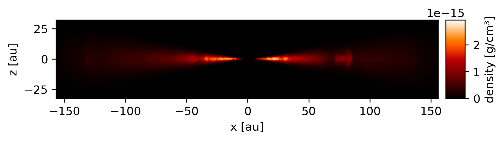
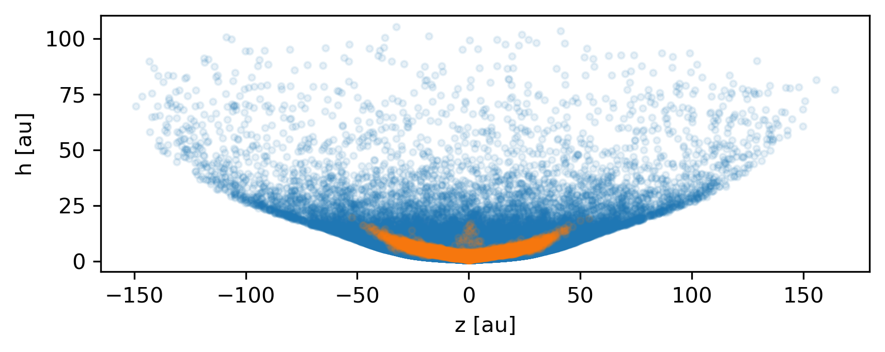

==========
Quickstart
==========

Quickstart guide for simple Plonk usage.

---------
Load data
---------

~~~~~~~~~~~~~
Load snapshot
~~~~~~~~~~~~~

Load a single snapshot and see what arrays are available.

.. code-block:: python

    >>> import plonk

    >>> snap = plonk.load_snap('disc_00030.h5')

    >>> snap.available_arrays()
    ('density',
     'dust_to_gas_ratio',
     'mass',
     'position',
     'pressure',
     'smoothing_length',
     'sound_speed',
     'stopping_time',
     'sub_type',
     'timestep',
     'type',
     'velocity',
     'velocity_divergence')

Load a single snapshot and access particle arrays and properties.

.. code-block:: python

    >>> import plonk

    >>> snap = plonk.load_snap('disc_00030.h5')

    >>> snap['position']
    array([[-3.69505001e+14,  7.42032967e+14, -7.45096980e+13],
           [-1.63052677e+15,  1.16308971e+15,  1.92879212e+14],
           [-7.66283930e+14,  1.62532232e+15,  2.34302988e+13],
           ...,
           [ 1.39571712e+15, -1.16179990e+15,  8.09090354e+13],
           [ 9.53716176e+14,  9.98500386e+14,  4.93933367e+13],
           [ 1.21421196e+14,  2.08618956e+15,  1.12998892e+14]]) <Unit('centimeter')>

    >>> snap['position'].to('au')
    array([[ -24.6998837 ,   49.60184016,   -4.98066567],
           [-108.99398271,   77.74774493,   12.89317897],
           [ -51.22291689,  108.64608658,    1.56621873],
           ...,
           [  93.29792694,  -77.66152625,    5.40843496],
           [  63.75198868,   66.74562821,    3.30174062],
           [   8.11650561,  139.453159  ,    7.55350939]]) <Unit('astronomical_unit')>

    >>> snap.properties['time']
    61485663602.558136 <Unit('second')>

Load a single snapshot and add extra quantities on the particles, computed as
required.

.. code-block:: python

    >>> import plonk

    >>> snap = plonk.load_snap('disc_00030.h5')

    >>> snap.extra_quantities()
    <plonk.Snap "disc_00030.h5">

    >>> snap.available_arrays()
    ('angular_momentum',
     'angular_velocity',
     'azimuthal_angle',
     'density',
     'dust_to_gas_ratio',
     'eccentricity',
     'inclination',
     'keplerian_frequency',
     'kinetic_energy',
     'mass',
     'momentum',
     'polar_angle',
     'position',
     'pressure',
     'radius_cylindrical',
     'radius_spherical',
     'semi_major_axis',
     'smoothing_length',
     'sound_speed',
     'specific_angular_momentum',
     'stokes_number',
     'stopping_time',
     'sub_type',
     'temperature',
     'timestep',
     'type',
     'velocity',
     'velocity_divergence',
     'velocity_radial_cylindrical',
     'velocity_radial_spherical')

Load a single snapshot and access sink arrays.

.. code-block:: python

    >>> import plonk

    >>> snap = plonk.load_snap('disc_00030.h5')

    >>> snap.available_sink_arrays()
    ('accretion_radius',
     'last_injection_time',
     'mass',
     'mass_accreted',
     'position',
     'softening_radius',
     'spin',
     'velocity')

    >>> snap.sinks['spin']
    array([[ 3.56866999e+43, -1.17910663e+44,  2.44598074e+47],
           [ 4.14083556e+43,  1.19118555e+43,  2.62569386e+46]]) <Unit('centimeter ** 2 * gram / second')>

~~~~~~~~~~~~~~~~~~~~~
Load auxilliary files
~~~~~~~~~~~~~~~~~~~~~

Load a Phantom `.ev` file, and see what columns are available.

.. code-block:: python

    >>> import plonk

    >>> ev = plonk.load_ev('disc01.ev')

    >>> ev.columns
    Index(['time', 'energy_kinetic', 'energy_thermal', 'energy_magnetic',
           'energy_potential', 'energy_total', 'momentum', 'angular_momentum',
           'density_max', 'density_average', 'timestep', 'entropy',
           'mach_number_rms', 'velocity_rms', 'center_of_mass_x',
           'center_of_mass_y', 'center_of_mass_z', 'gas_density_max',
           'gas_density_average', 'dust_density_max', 'dust_density_average'],
          dtype='object')

    >>> ev
                 time  energy_kinetic  ...  dust_density_max  dust_density_average
    0        0.000000        0.000013  ...      1.720023e-10          8.015937e-12
    1        1.593943        0.000013  ...      1.714059e-10          8.015771e-12
    2        6.375774        0.000013  ...      1.696885e-10          8.018406e-12
    3       25.503096        0.000013  ...      1.636469e-10          8.061417e-12
    4       51.006191        0.000013  ...      1.580470e-10          8.210622e-12
    ..            ...             ...  ...               ...                   ...
    548  12394.504462        0.000013  ...      1.481833e-09          2.482929e-11
    549  12420.007557        0.000013  ...      1.020596e-09          2.483358e-11
    550  12445.510653        0.000013  ...      8.494835e-10          2.488946e-11
    551  12471.013748        0.000013  ...      6.517475e-10          2.497029e-11
    552  12496.516844        0.000013  ...      5.205011e-10          2.506445e-11

    [553 rows x 21 columns]

~~~~~~~~~~~~~~~
Load simulation
~~~~~~~~~~~~~~~

Load a simulation, and access snapshots and other data.

.. code-block:: python

    >>> import plonk

    >>> sim = plonk.load_sim(prefix='disc')

    >>> snaps = sim.snaps
    [<plonk.Snap "disc_00000.h5">,
     <plonk.Snap "disc_00001.h5">,
     <plonk.Snap "disc_00002.h5">,
     <plonk.Snap "disc_00003.h5">,
     <plonk.Snap "disc_00004.h5">,
     <plonk.Snap "disc_00005.h5">,
     <plonk.Snap "disc_00006.h5">,
     <plonk.Snap "disc_00007.h5">,
     <plonk.Snap "disc_00008.h5">,
     <plonk.Snap "disc_00009.h5">,
     <plonk.Snap "disc_00010.h5">,
     <plonk.Snap "disc_00011.h5">,
     <plonk.Snap "disc_00012.h5">,
     <plonk.Snap "disc_00013.h5">,
     <plonk.Snap "disc_00014.h5">,
     <plonk.Snap "disc_00015.h5">,
     <plonk.Snap "disc_00016.h5">,
     <plonk.Snap "disc_00017.h5">,
     <plonk.Snap "disc_00018.h5">,
     <plonk.Snap "disc_00019.h5">,
     <plonk.Snap "disc_00020.h5">,
     <plonk.Snap "disc_00021.h5">,
     <plonk.Snap "disc_00022.h5">,
     <plonk.Snap "disc_00023.h5">,
     <plonk.Snap "disc_00024.h5">,
     <plonk.Snap "disc_00025.h5">,
     <plonk.Snap "disc_00026.h5">,
     <plonk.Snap "disc_00027.h5">,
     <plonk.Snap "disc_00028.h5">,
     <plonk.Snap "disc_00029.h5">,
     <plonk.Snap "disc_00030.h5">]

    >>> sim.global_quantities
    # Output is a pandas DataFrame

    >>> sim.sink_quantities
    # Output is a list of pandas DataFrames

-------------
Visualization
-------------

~~~~~~~~~~~~~~~
Projection plot
~~~~~~~~~~~~~~~

Produce a projection image plot of density.

.. code-block:: python

    >>> import plonk

    >>> snap = plonk.load_snap('disc_00030.h5')

    >>> plonk.visualize.plot(snap=snap, quantity='density')

.. image:: _static/density.png

Set plot extent, colormap, colorbar range, and axis units.

.. code-block:: python

    >>> import plonk

    >>> snap = plonk.load_snap('disc_00030.h5')

    >>> au = plonk.units('au')

    >>> ax = plonk.visualize.plot(
    ...     snap=snap,
    ...     quantity='density',
    ...     extent=(20, 120, -50, 50) * au,
    ...     units={'extent': 'au'},
    ...     cmap='gist_heat',
    ...     vmin=0.1,
    ...     vmax=0.2,
    ... )

.. image:: _static/density2.png

~~~~~~~~~~~~~~~~~~
Cross-section plot
~~~~~~~~~~~~~~~~~~

Produce a cross-section image plot of density.

.. code-block:: python

    >>> import plonk

    >>> snap = plonk.load_snap('disc_00030.h5')

    >>> ax = plonk.visualize.plot(
    ...     snap=snap,
    ...     quantity='density',
    ...     x='x',
    ...     y='z',
    ...     interp='cross_section',
    ...     cmap='gist_heat',
    ...     units={'extent': 'au'},
    ... )

~~~~~~~~~~~~~
Particle plot
~~~~~~~~~~~~~

Produce a plot of the particles with z-coordinate on the x-axis and smoothing
length on the y-axis.

The different colours refer to different particle types.

.. code-block:: python

    >>> import plonk

    >>> snap = plonk.load_snap('disc_00030.h5')

    >>> ax = plonk.visualize.particle_plot(
    ...     snap=snap, x='z', y='h', alpha=0.1,
    ... )

Plot particles with color representing density.

.. code-block:: python

    >>> import plonk

    >>> snap = plonk.load_snap('disc_00030.h5')

    >>> ax = plonk.visualize.particle_plot(
    ...     snap=snap, x='x', y='z', c='density', units={'x': 'au', 'y': 'au'},
    ... )
    >>> ax.set_xlim(-50, 50)
    >>> ax.set_ylim(-20, 20)

--------
Analysis
--------

~~~~~~~~
Subsnaps
~~~~~~~~

Access the gas and dust subsets of the particles as a SubSnap.

.. code-block:: python

    >>> import plonk

    >>> snap = plonk.load_snap('disc_00030.h5')

    >>> gas = snap['gas']

    >>> gas['mass'].to('solar_mass')[0]
    9.99999999999999e-10 <Unit('solar_mass')>

    # Returns a list as there can be multiple dust sub-types
    >>> snap['dust']
    [<plonk.SubSnap "disc_00030.h5">]

    >>> snap['dust'][0]['mass'].to('solar_mass')[0]
    9.99999999999999e-11 <Unit('solar_mass')>

Generate a SubSnap of particles within some region.

.. code-block:: python

    >>> import plonk

    >>> snap = plonk.load_snap('disc_00030.h5')

    >>> snap['x'].to('au').min()
    -598.1288172965254 <Unit('astronomical_unit')>

    # Particles with positive x-coordinate.
    >>> subsnap = snap[snap['x'] > 0]

    >>> subsnap['x'].to('au').min()
    0.0002668455543031563 <Unit('astronomical_unit')>

~~~~~~~
Profile
~~~~~~~

Create a radial profile.

.. code-block:: python

    >>> import plonk

    >>> snap = plonk.load_snap('disc_00030.h5')

    >>> prof = plonk.load_profile(snap)

    >>> prof.available_profiles()
    ('angular_momentum_phi',
     'angular_momentum_theta',
     'aspect_ratio',
     'density',
     'dust_mass_001',
     'dust_surface_density_001',
     'dust_to_gas_ratio',
     'gas_mass',
     'gas_surface_density',
     'mass',
     'number',
     'position',
     'pressure',
     'radius',
     'scale_height',
     'size',
     'smoothing_length',
     'sound_speed',
     'stopping_time',
     'sub_type',
     'surface_density',
     'timestep',
     'toomre_Q',
     'type',
     'velocity',
     'velocity_divergence')

    >>> prof['surface_density']
    array([0.01271039, 0.02865819, 0.04067127, 0.05149332, 0.06517471,
           0.08249241, 0.09637796, 0.10894536, 0.1180496 , 0.12765387,
           0.13273897, 0.13777124, 0.14111602, 0.14282742, 0.145969  ,
           0.14673176, 0.1481213 , 0.1484152 , 0.14889608, 0.14909938,
           0.14953987, 0.14954986, 0.14994646, 0.14897097, 0.14972681,
           0.14970705, 0.14847499, 0.14784934, 0.14520481, 0.14291035,
           0.13908764, 0.13618617, 0.13281137, 0.13105751, 0.13013781,
           0.12858083, 0.12947576, 0.12726514, 0.12662418, 0.12583058,
           0.12470909, 0.12412849, 0.12355702, 0.12408329, 0.12501586,
           0.12613285, 0.12840858, 0.13001517, 0.13208028, 0.1325977 ,
           0.13393635, 0.1347609 , 0.13422298, 0.13470778, 0.1341627 ,
           0.13361293, 0.13220966, 0.13113586, 0.12922049, 0.12823264,
           0.12620479, 0.12476726, 0.12369766, 0.12195328, 0.12061618,
           0.11875485, 0.11630568, 0.11454608, 0.11096825, 0.10793763,
           0.10369441, 0.09923215, 0.09429677, 0.08922675, 0.08417294,
           0.07820635, 0.07329912, 0.06744614, 0.06248629, 0.05670113,
           0.05031995, 0.04459406, 0.03960302, 0.03439841, 0.02964247,
           0.02460624, 0.02075047, 0.01733462, 0.01396035, 0.01062678,
           0.00837714, 0.00636641, 0.00525715, 0.00458604, 0.00361685,
           0.00312283, 0.00280484, 0.00247301, 0.00228797, 0.00205925]) <Unit('gram / centimeter ** 2')>

Plot a radial profile.

.. code-block:: python

    >>> import matplotlib.pyplot as plt
    >>> import plonk

    >>> snap = plonk.load_snap('disc_00030.h5')

    >>> prof = plonk.load_profile(snap)

    >>> with plt.style.context('seaborn'):
    ...     ax = prof.plot('radius', 'scale_height', x_unit='au', y_unit='au')
    ...     ax.set_ylabel('Scale height [au]')
    ...     ax.legend().remove()

.. image:: _static/scale_height.png

Generate and plot a profile in the z-coordinate with a SubSnap of particles by
radius.

.. code-block:: python

    >>> import matplotlib.pyplot as plt
    >>> import plonk

    >>> snap = plonk.load_snap('disc_00030.h5')

    >>> au = plonk.units('au')
    >>> subsnap = snap[(snap['R'] > 50*au) & (snap['R'] < 55*au)]

    >>> prof = plonk.load_profile(
    ...     subsnap,
    ...     ndim=1,
    ...     coordinate='z',
    ...     cmin='-15 au',
    ...     cmax='15 au',
    ... )

    >>> with plt.style.context('seaborn'):
    ...     ax = prof.plot('radius', 'density', x_unit='au')
    ...     ax.set_ylabel(r'Density [g/cm${}^3$]')
    ...     ax.legend().remove()

.. image:: _static/profile_z.png
