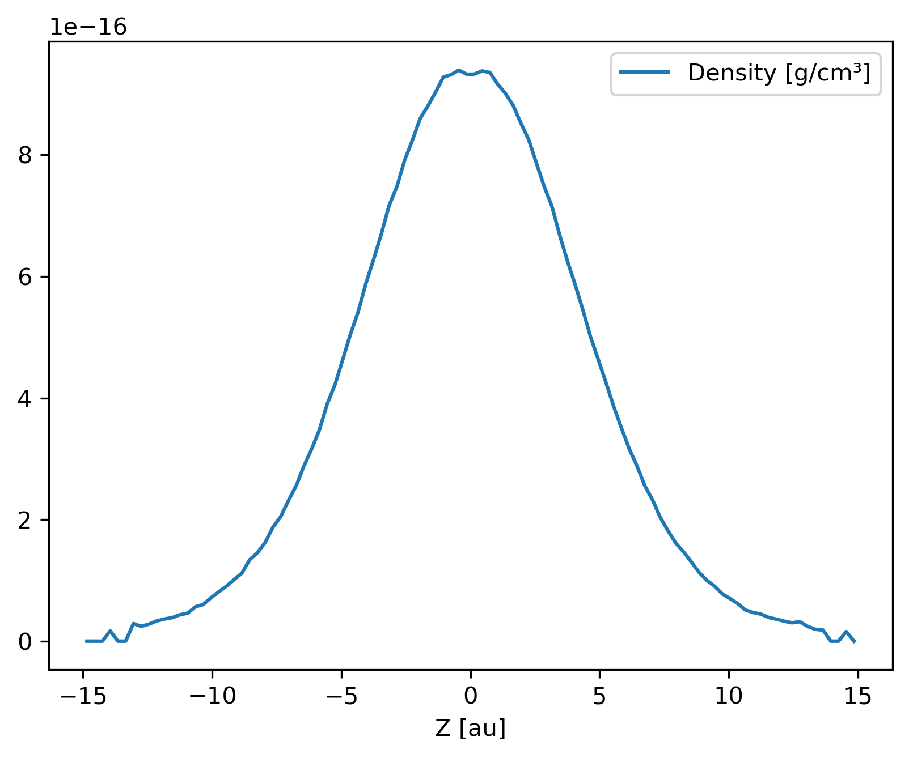

--------
Analysis
--------

~~~~~~~~
Subsnaps
~~~~~~~~

Access the gas and dust subsets of the particles as a SubSnap.

.. code-block:: python

    >>> import plonk

    >>> snap = plonk.load_snap('disc_00030.h5')

    >>> gas = snap['gas']

    >>> gas['mass'].to('solar_mass')[0]
    9.99999999999999e-10 <Unit('solar_mass')>

    # Returns a list as there can be multiple dust sub-types
    >>> snap['dust']
    [<plonk.SubSnap "disc_00030.h5">]

    >>> snap['dust'][0]['mass'].to('solar_mass')[0]
    9.99999999999999e-11 <Unit('solar_mass')>

Generate a SubSnap of particles within some region.

.. code-block:: python

    >>> import plonk

    >>> snap = plonk.load_snap('disc_00030.h5')

    >>> snap['x'].to('au').min()
    -598.1288172965254 <Unit('astronomical_unit')>

    # Particles with positive x-coordinate.
    >>> subsnap = snap[snap['x'] > 0]

    >>> subsnap['x'].to('au').min()
    0.0002668455543031563 <Unit('astronomical_unit')>

~~~~~~~
Profile
~~~~~~~

Create a radial profile.

.. code-block:: python

    >>> import plonk

    >>> snap = plonk.load_snap('disc_00030.h5')

    >>> prof = plonk.load_profile(snap)

    >>> prof.available_profiles()
    ('angular_momentum_mag',
     'angular_momentum_phi',
     'angular_momentum_theta',
     'angular_momentum_x',
     'angular_momentum_y',
     'angular_momentum_z',
     'angular_velocity',
     'aspect_ratio',
     'azimuthal_angle',
     'density',
     'dust_to_gas_ratio_001',
     'dust_to_gas_ratio_tot',
     'eccentricity',
     'id',
     'inclination',
     'keplerian_frequency',
     'kinetic_energy',
     'mass',
     'momentum_mag',
     'momentum_x',
     'momentum_y',
     'momentum_z',
     'number',
     'polar_angle',
     'position_mag',
     'position_x',
     'position_y',
     'position_z',
     'pressure',
     'radius',
     'radius_cylindrical',
     'radius_spherical',
     'scale_height',
     'semi_major_axis',
     'size',
     'smoothing_length',
     'sound_speed',
     'specific_angular_momentum_mag',
     'specific_angular_momentum_x',
     'specific_angular_momentum_y',
     'specific_angular_momentum_z',
     'stokes_number_001',
     'stokes_number_tot',
     'stopping_time_001',
     'stopping_time_tot',
     'sub_type',
     'surface_density',
     'temperature',
     'timestep',
     'toomre_Q',
     'type',
     'velocity_divergence',
     'velocity_mag',
     'velocity_radial_cylindrical',
     'velocity_radial_spherical',
     'velocity_x',
     'velocity_y',
     'velocity_z')

    >>> prof['surface_density']
    array([0.12710392, 0.28658185, 0.40671266, 0.51493316, 0.65174709,
           0.82492413, 0.96377964, 1.08945358, 1.18049604, 1.27653871,
           1.32738967, 1.37771242, 1.41116016, 1.42827418, 1.45969001,
           1.46731756, 1.48121301, 1.48415196, 1.48896081, 1.49099377,
           1.49539866, 1.49549864, 1.49946459, 1.48970975, 1.49726806,
           1.49707047, 1.48474985, 1.47849345, 1.45204807, 1.42910354,
           1.39087639, 1.36186174, 1.32811369, 1.31057511, 1.30137812,
           1.28580834, 1.29475762, 1.27265139, 1.2662418 , 1.25830579,
           1.2470909 , 1.24128492, 1.23557015, 1.24083293, 1.25015857,
           1.26132853, 1.28408577, 1.30015172, 1.32080284, 1.325977  ,
           1.33936347, 1.34760897, 1.34222981, 1.34707782, 1.34162702,
           1.33612932, 1.32209663, 1.31135862, 1.29220491, 1.28232641,
           1.26204789, 1.24767264, 1.23697665, 1.21953283, 1.20616179,
           1.18754849, 1.16305682, 1.14546076, 1.10968249, 1.07937633,
           1.0369441 , 0.99232149, 0.94296769, 0.89226746, 0.84172944,
           0.78206348, 0.73299116, 0.67446142, 0.62486291, 0.56701135,
           0.5031995 , 0.44594058, 0.39603015, 0.34398414, 0.29642473,
           0.24606244, 0.20750469, 0.17334624, 0.13960351, 0.10626775,
           0.08377139, 0.06366415, 0.05257149, 0.04586044, 0.03616855,
           0.03122829, 0.02804837, 0.02473014, 0.02287971, 0.02059255]) <Unit('kilogram / meter ** 2')>

Plot a radial profile.

.. code-block:: python

    >>> import matplotlib.pyplot as plt
    >>> import plonk

    >>> snap = plonk.load_snap('disc_00030.h5')

    >>> prof = plonk.load_profile(snap)

    >>> units = {'position': 'au', 'scale_height': 'au'}
    >>> ax = prof.plot('radius', 'scale_height', units=units)
    >>> ax.set_ylabel('Scale height [au]')
    >>> ax.legend().remove()

.. image:: ../_static/scale_height.png

Generate and plot a profile in the z-coordinate with a SubSnap of particles by
radius.

.. code-block:: python

    >>> import matplotlib.pyplot as plt
    >>> import plonk
    >>> from plonk.analysis.filters import annulus

    >>> snap = plonk.load_snap('disc_00030.h5')

    >>> au = plonk.units('au')
    >>> subsnap = annulus(snap=snap, radius_min=50*au, radius_max=55*au, height=100*au)

    >>> prof = plonk.load_profile(
    ...     subsnap,
    ...     ndim=1,
    ...     coordinate='z',
    ...     cmin='-15 au',
    ...     cmax='15 au',
    ... )

    >>> units = {'position': 'au', 'density': 'g/cm^3'}
    >>> ax = prof.plot('z', 'density', units=units)

