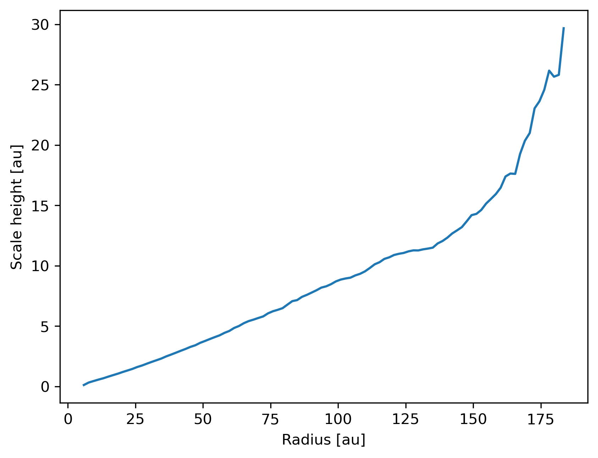

--------
Analysis
--------

.. currentmodule:: plonk

~~~~~~~~~
Sub-snaps
~~~~~~~~~

Access the gas and dust subsets of the particles as a :class:`SubSnap`.

.. code-block:: python

    >>> import plonk

    >>> snap = plonk.load_snap('disc_00030.h5')

    >>> gas = snap.family('gas')

    # Dust can have multiple sub-species
    # So we combine into one family with squeeze=True
    >>> dust = snap.family('dust', squeeze=True)

    >>> gas['mass'].sum().to('solar_mass')
    0.0010000000000000005 <Unit('solar_mass')>

    >>> dust['mass'].sum().to('earth_mass')
    3.326810503428664 <Unit('earth_mass')>

Generate a :class:`SubSnap` with a boolean mask.

.. code-block:: python

    >>> import plonk

    >>> snap = plonk.load_snap('disc_00030.h5')

    >>> snap['x'].to('au').min()
    -598.1288172965254 <Unit('astronomical_unit')>

    # Particles with positive x-coordinate.
    >>> mask = snap['x'] > 0

    >>> subsnap = snap[mask]

    >>> subsnap['x'].to('au').min()
    0.0002668455543031563 <Unit('astronomical_unit')>

Generate a :class:`SubSnap` of particles from lists or slices of indices.

.. code-block:: python

    >>> import plonk

    >>> snap = plonk.load_snap('disc_00030.h5')

    # Generate SubSnap from slices
    >>> subsnap = snap[:1000]

    # Generate SubSnap from lists
    >>> subsnap = snap[[0, 1, 2, 3, 4]]

~~~~~~~
Filters
~~~~~~~

Filters are available to generate :class:`SubSnap` from geometric shapes.

.. code-block:: python

    >>> import plonk

    >>> from plonk.analysis import filters

    >>> au = plonk.units['au']

    >>> snap = plonk.load_snap('disc_00030.h5')

    >>> width = 50 * au
    >>> subsnap = filters.box(snap=snap, xwidth=width, ywidth=width, zwidth=width)

    >>> radius_min, radius_max, height = 50 * au,  100 * au, 10 * au
    >>> subsnap = filters.annulus(
    ...     snap=snap, radius_min=radius_min, radius_max=radius_max, height=height
    ... )

~~~~~~~~~~
Quantities
~~~~~~~~~~

Calculate extra quantities on particle arrays. Note that many of these are
available by default.

.. code-block:: python

    >>> import plonk

    >>> from plonk.analysis import particles

    >>> snap = plonk.load_snap('disc_00030.h5')

    # Calculate angular momentum of each particle
    >>> particles.angular_momentum(snap=snap)
    array([[-2.91051358e+36,  5.03265707e+36,  6.45532986e+37],
           [ 7.83210945e+36, -5.83981869e+36,  1.01424601e+38],
           [ 5.42707198e+35, -1.15387855e+36,  9.77918546e+37],
           ...,
           [-3.65688200e+35,  2.36337004e+35,  9.70192741e+36],
           [-8.47414806e+35,  3.91073248e+35,  8.45673620e+36],
           [-1.04934629e+36, -5.04112542e+35,  1.04345024e+37]]) <Unit('kilogram * meter ** 2 / second')>

Calculate total (summed) quantities on a Snap.

.. code-block:: python

    >>> import plonk

    >>> from plonk.analysis import total

    >>> snap = plonk.load_snap('disc_00030.h5')

    # Calculate the center of mass over all particles including sinks
    >>> total.center_of_mass(snap=snap).to('au')
    array([-1.52182463e-07,  1.25054338e-08,  6.14859166e-07]) <Unit('astronomical_unit')>

    # Calculate the kinetic energy including sinks
    >>> total.kinetic_energy(snap=snap).to('joule')
    2.232949413087673e+34 <Unit('joule')>

~~~~~~~~
Profiles
~~~~~~~~

A :class:`Profile` allows for creating a 1-dimensional profile through the
3-dimensional data. Here we create a (cylindrical) radial profile.

.. code-block:: python

    >>> import plonk

    >>> snap = plonk.load_snap('disc_00030.h5')

    >>> prof = plonk.load_profile(snap)

    >>> prof.available_profiles()
    ['alpha_shakura_sunyaev',
     'angular_momentum_mag',
     'angular_momentum_phi',
     'angular_momentum_theta',
     'angular_momentum_x',
     'angular_momentum_y',
     'angular_momentum_z',
     'angular_velocity',
     'aspect_ratio',
     'azimuthal_angle',
     'density',
     'disc_viscosity',
     'dust_to_gas_ratio_001',
     'epicyclic_frequency',
     'id',
     'kinetic_energy',
     'mass',
     'midplane_stokes_number_001',
     'momentum_mag',
     'momentum_x',
     'momentum_y',
     'momentum_z',
     'number',
     'polar_angle',
     'position_mag',
     'position_x',
     'position_y',
     'position_z',
     'pressure',
     'radius',
     'radius_cylindrical',
     'radius_spherical',
     'scale_height',
     'size',
     'smoothing_length',
     'sound_speed',
     'specific_angular_momentum_mag',
     'specific_angular_momentum_x',
     'specific_angular_momentum_y',
     'specific_angular_momentum_z',
     'specific_kinetic_energy',
     'stopping_time_001',
     'sub_type',
     'surface_density',
     'temperature',
     'timestep',
     'toomre_q',
     'type',
     'velocity_divergence',
     'velocity_mag',
     'velocity_radial_cylindrical',
     'velocity_radial_spherical',
     'velocity_x',
     'velocity_y',
     'velocity_z']

    >>> prof['surface_density']
    array([0.12710392, 0.28658185, 0.40671266, 0.51493316, 0.65174709,
           0.82492413, 0.96377964, 1.08945358, 1.18049604, 1.27653871,
           1.32738967, 1.37771242, 1.41116016, 1.42827418, 1.45969001,
           1.46731756, 1.48121301, 1.48415196, 1.48896081, 1.49099377,
           1.49539866, 1.49549864, 1.49946459, 1.48970975, 1.49726806,
           1.49707047, 1.48474985, 1.47849345, 1.45204807, 1.42910354,
           1.39087639, 1.36186174, 1.32811369, 1.31057511, 1.30137812,
           1.28580834, 1.29475762, 1.27265139, 1.2662418 , 1.25830579,
           1.2470909 , 1.24128492, 1.23557015, 1.24083293, 1.25015857,
           1.26132853, 1.28408577, 1.30015172, 1.32080284, 1.325977  ,
           1.33936347, 1.34760897, 1.34222981, 1.34707782, 1.34162702,
           1.33612932, 1.32209663, 1.31135862, 1.29220491, 1.28232641,
           1.26204789, 1.24767264, 1.23697665, 1.21953283, 1.20616179,
           1.18754849, 1.16305682, 1.14546076, 1.10968249, 1.07937633,
           1.0369441 , 0.99232149, 0.94296769, 0.89226746, 0.84172944,
           0.78206348, 0.73299116, 0.67446142, 0.62486291, 0.56701135,
           0.5031995 , 0.44594058, 0.39603015, 0.34398414, 0.29642473,
           0.24606244, 0.20750469, 0.17334624, 0.13960351, 0.10626775,
           0.08377139, 0.06366415, 0.05257149, 0.04586044, 0.03616855,
           0.03122829, 0.02804837, 0.02473014, 0.02287971, 0.02059255]) <Unit('kilogram / meter ** 2')>

Plot a radial profile.

.. code-block:: python

    >>> import matplotlib.pyplot as plt

    >>> import plonk

    >>> snap = plonk.load_snap('disc_00030.h5')

    >>> prof = plonk.load_profile(snap)

    >>> prof.set_units(position='au', scale_height='au')

    >>> ax = prof.plot('radius', 'scale_height')

    >>> ax.set_ylabel('Scale height [au]')

    >>> ax.legend().remove()

Generate and plot a :class:`Profile` in the z-coordinate with a :class:`SubSnap`
of particles by radius.

.. code-block:: python

    >>> import matplotlib.pyplot as plt

    >>> import plonk

    >>> from plonk.analysis.filters import annulus

    >>> snap = plonk.load_snap('disc_00030.h5')

    >>> au = plonk.units('au')

    >>> subsnap = annulus(snap=snap, radius_min=50*au, radius_max=55*au, height=100*au)

    >>> prof = plonk.load_profile(
    ...     subsnap,
    ...     ndim=1,
    ...     coordinate='z',
    ...     cmin='-15 au',
    ...     cmax='15 au',
    ... )

    >>> prof.set_units(position='au', density='g/cm^3')

    >>> ax = prof.plot('z', 'density')

.. image:: _static/profile_z.png

~~~~~~~~~~
Neighbours
~~~~~~~~~~

Find particle neighbours using :meth:`~Snap.neighbours` via a k-d tree. The
implementation uses the efficient `scipy.spatial.cKDTree`.

.. code-block:: python

    >>> import plonk

    >>> snap = plonk.load_snap('disc_00030.h5')

    >>> snap.tree
    <scipy.spatial.ckdtree.cKDTree at 0x7f93b2ebe5d0>

    # Set the kernel
    >>> snap.set_kernel('cubic')
    <plonk.Snap "disc_00030.h5">

    # Find the neighbours of the first three particles
    >>> snap.neighbours([0, 1, 2])
    array([list([0, 11577, 39358, 65206, 100541, 156172, 175668, 242733, 245164, 299982, 308097, 330616, 341793, 346033, 394169, 394989, 403486, 434384, 536961, 537992, 543304, 544019, 572776, 642232, 718644, 739509, 783943, 788523, 790235, 866558, 870590, 876347, 909455, 933386, 960933]),
           list([1, 13443, 40675, 44855, 45625, 46153, 49470, 53913, 86793, 91142, 129970, 142137, 153870, 163901, 185811, 199424, 242146, 266164, 268662, 381989, 433794, 434044, 480663, 517156, 563684, 569709, 619541, 687099, 705301, 753942, 830461, 884950, 930245, 949838]),
           list([2, 7825, 22380, 30099, 36164, 65962, 67630, 70636, 82278, 88742, 127335, 145738, 158511, 171438, 248893, 274204, 274313, 282427, 388144, 436499, 444614, 534555, 561393, 599283, 712841, 790972, 813445, 824461, 853507, 912956, 982408, 986423, 1046879, 1092432])],
          dtype=object)

Get neighbours of one type only by first creating a :class:`SubSnap`. Note that
the returned indices are relative to type.

.. code-block:: python

    >>> import plonk

    >>> snap = plonk.load_snap('disc_00030.h5')

    >>> snap.set_kernel('cubic')

    >>> dust = snap.family('dust', squeeze=True)

    # Find the neighbours of the first three dust particles
    >>> dust.neighbours([0, 1, 2])
    array([list([0, 10393, 14286, 19847, 20994, 25954, 33980, 52721, 59880, 66455, 70031, 75505, 75818, 82947, 93074, 93283, 95295]),
           list([1, 3663, 6676, 8101, 10992, 13358, 15606, 20680, 28851, 35049, 35791, 36077, 39682, 48589, 49955, 52152, 66884, 84440, 88573, 96170, 97200]),
           list([2, 6926, 9685, 12969, 15843, 31285, 34642, 45735, 47433, 53258, 54329, 56565, 58468, 63105, 63111, 63619, 67517, 70483, 73277, 74340, 78988, 81391, 83534, 83827, 85351, 86117, 94404, 97329])],
          dtype=object)
