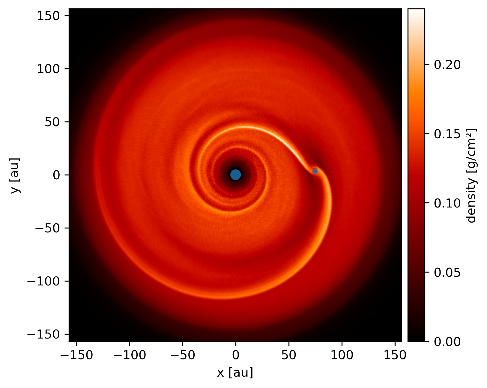

# Accretion radius

Plot the accretion radius on the sink particles.



```{note}
The data is from the [example dataset](https://figshare.com/articles/dataset/Plonk_example_dataset/12885587) of
a Phantom simulation with a single dust species using the separate particles
(or "2-fluid") method with an embedded planet.
```

```python
import plonk
from plonk.utils.visualize import plot_smoothing_length

snap = plonk.load_snap('disc_00030.h5')

# Here "..." means take all sinks
indices = ...

snap.set_units(position='au', density='g/cm^3', projection='cm')

ax = snap.image('density', cmap='gist_heat')

plot_smoothing_length(snap=snap.sinks, indices=indices, alpha=0.8, ax=ax)
```
