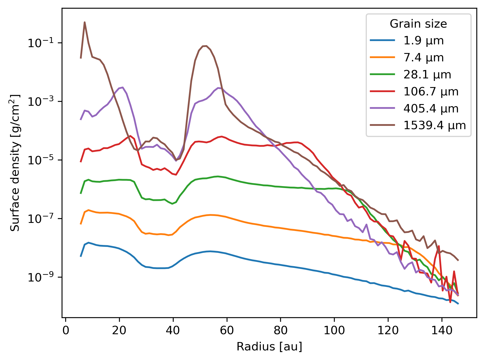

# Dust profiles

Plot the surface density profile of each dust species.



```{note}
The data is from a Phantom simulation with multiple dust species using the
mixture (or "1-fluid") method with an embedded planet available from
[figshare](https://figshare.com/articles/dataset/Plonk_example_multi-species_dust-gas_protoplanetary_disc_using_mixture_method/12885641).
```

```python
import plonk

snap = plonk.load_snap('dstau2mj_00130.h5')

prof = plonk.load_profile(snap)

# Set the profile units for plotting
prof.set_units(position='au', dust_surface_density='g/cm^2')

# Get the grain size per species as labels for the plot
labels = [f'{size:.1f~P}' for size in snap.properties['grain_size'].to('micrometer')]

# Set the y-label and set the y-scale to logarithmic
ax_kwargs = {'ylabel': r'Surface density [g/cm${}^2$]', 'yscale': 'log'}

# Make the plot
ax = prof.plot(x='radius', y='dust_surface_density', label=labels, ax_kwargs=ax_kwargs)
ax.legend(title='Grain size')
```
